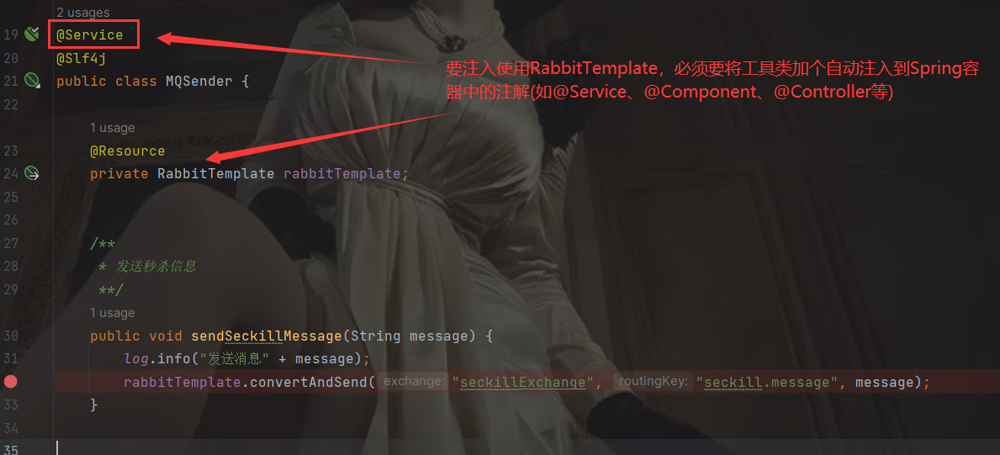
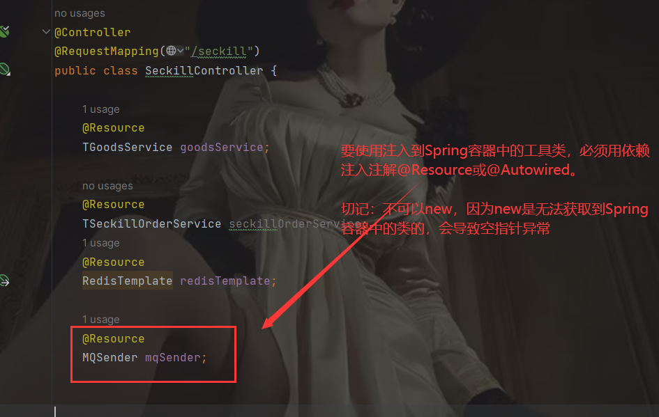
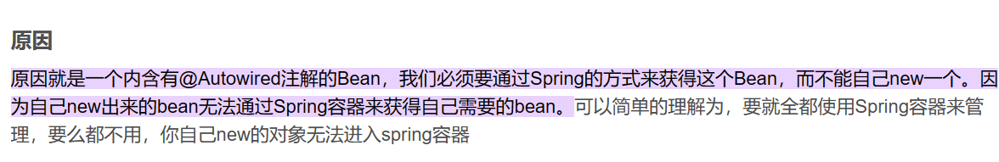

首先：

最后：

> 总结：定义一个工具来发送信息，因为要发送信息，所以会用到RabbitTemplate，用到这个就得用到@Resource等依赖注入的注解，因为从Spring依赖注入了，那必须得在类上加上@Service等的一些自动注入到Spring容器的注解，那么都注入到Spring容器了，在其他类中使用发送工具类的方法就必须得加上@Resource依赖注入一下才行，不然会空指针异常。

