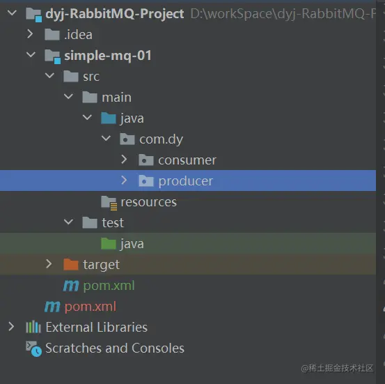
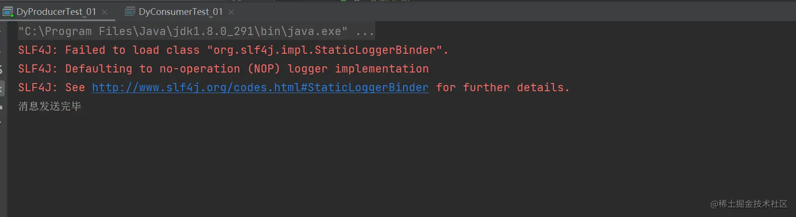
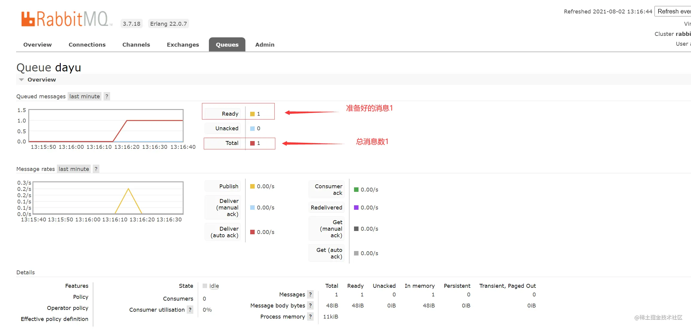
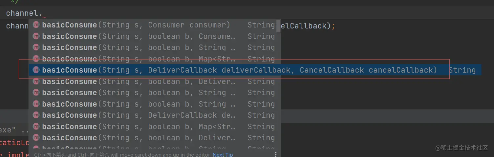
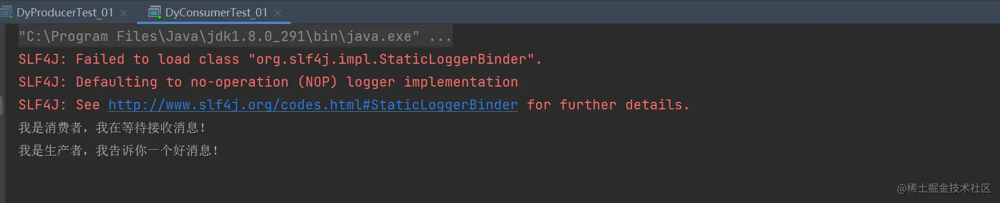
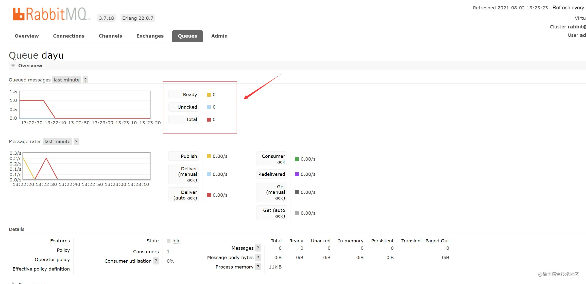
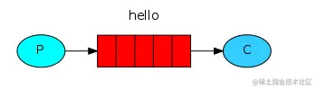

### 简单队列模式（点对点模式）

* 新建个maven项目，大概目录结构如下

  

* pom导入jar

  ```XML
  <!--指定 jdk 编译版本-->
      <build>
          <plugins>
              <plugin>
                  <groupId>org.apache.maven.plugins</groupId>
                  <artifactId>maven-compiler-plugin</artifactId>
                  <configuration>
                      <source>8</source>
                      <target>8</target>
                  </configuration>
              </plugin>
          </plugins>
      </build>
      <dependencies>
          <!--rabbitmq 依赖客户端-->
          <dependency>
              <groupId>com.rabbitmq</groupId>
              <artifactId>amqp-client</artifactId>
              <version>5.8.0</version>
          </dependency>
          <!--操作文件流的一个依赖-->
          <dependency>
              <groupId>commons-io</groupId>
              <artifactId>commons-io</artifactId>
              <version>2.6</version>
          </dependency>
      </dependencies>
  ```

  

### 一、生产者

- ```java
  java复制代码package com.dy.producer;
  
  import com.rabbitmq.client.Channel;
  import com.rabbitmq.client.Connection;
  import com.rabbitmq.client.ConnectionFactory;
  
  /**
   * 这是一个测试的生产者
   *@author DingYongJun
   *@date 2021/8/1
   */
  public class DyProducerTest_01 {
      public static final String Queue_name = "dayu";
  
      /**
       * 这里为了方便，我们使用main函数来测试
       * 纯属看你个人选择
       * @param args
       */
      public static void main(String[] args) throws Exception{
          //创建一个连接工厂
          ConnectionFactory factory = new ConnectionFactory();
          factory.setHost("120.48.29.41");
          factory.setUsername("admin");
          factory.setPassword("111111");
  
          //创建一个新连接
          Connection connection = factory.newConnection();
          //创建一个通道 channel 实现了自动 close 接口 自动关闭 不需要显示关闭
          Channel channel = connection.createChannel();
  
          /**
           * 生成一个队列
           * 1.队列名称
           * 2.队列里面的消息是否持久化 默认消息存储在内存中
           * 3.该队列是否只供一个消费者进行消费 是否进行共享 true 可以多个消费者消费
           * 4.是否自动删除 最后一个消费者端开连接以后 该队列是否自动删除 true 自动删除
           * 5.其他参数
           */
          channel.queueDeclare(Queue_name,false,false,false,null);
          String message="我是生产者，我告诉你一个好消息！";
  
          /**
           * 发送一个消息
           * 1.发送到那个交换机
           * 2.路由的 key 是哪个
           * 3.其他的参数信息
           * 4.发送消息的消息体
           */
          channel.basicPublish("",Queue_name,null,message.getBytes());
          System.out.println("消息发送完毕");
      }
  }
  ```


- 执行一下看看是否能成功将消息发到队列中
  - 
- 查看RabbitMQ管理页面
  - 
- 证明生产者建立成功并成功发送了消息。

### 二、消费者

- ```java
  package com.dy.consumer;
  
  import com.rabbitmq.client.*;
  
  /**
   * 这是一个测试的消费者
   *@author DingYongJun
   *@date 2021/8/1
   */
  public class DyConsumerTest_01 {
      public static final String Queue_name = "dayu";
  
      public static void main(String[] args) throws Exception{
          //创建一个连接工厂
          ConnectionFactory factory = new ConnectionFactory();
          factory.setHost("120.48.29.41");
          factory.setUsername("admin");
          factory.setPassword("111111");
  
          //建立连接
          Connection connection = factory.newConnection();
          //建立通道
          Channel channel = connection.createChannel();
  
          System.out.println("我是消费者，我在等待接收消息！");
          DeliverCallback deliverCallback = (String var1, Delivery var2)->{
              String message= new String(var2.getBody());
              System.out.println(message);
          };
          CancelCallback cancelCallback = (String var1)->{
              System.out.println("消息消费被中断");
          };
  
          /**
           * 消费者消费消息
           * 1.消费哪个队列
           * 2.消费成功之后是否要自动应答 true 代表自动应答 false 手动应答
           * 3.消费者未成功消费的回调
           */
          channel.basicConsume(Queue_name,true,deliverCallback,cancelCallback);
      }
  }
  ```

- 解释下，DeliverCallback和CancelCallback

  - 看下需要哪些参数

  - 

  - 看下DeliverCallback，这是典型的函数式接口，所以我们可以用lamda表达式来创建它的对象。

    - ```java
      java复制代码import java.io.IOException;
      
      @FunctionalInterface
      public interface DeliverCallback {
          void handle(String var1, Delivery var2) throws IOException;
      }
      ```

  - CancelCallback同理

    - ```java
      java复制代码import java.io.IOException;
      
      @FunctionalInterface
      public interface CancelCallback {
          void handle(String var1) throws IOException;
      }
      ```

- 执行消费者，看是否能拿到指定队列的消息。

  - 
  - 成功消费消息。

- 查看RabbitMQ管理页面

  - 
  - 消息为零，证明消息成功被消费掉了！

### 三、总结

- 最简单的工作队列，其中一个消息生产者，一个消息消费者，一个队列。也称为`点对点模式`。
- 
- 生产者大致步骤
  - 获取连接
  - 创建通道
  - 创建队列声明
  - 发送消息
  - 关闭队列
- 消费者大致步骤
  - 获取连接
  - 获取通道
  - 监听队列
  - 消费消息
- 怎么样，看完这个简单队列模式，对mq的发布订阅有了个基本认知了吧！