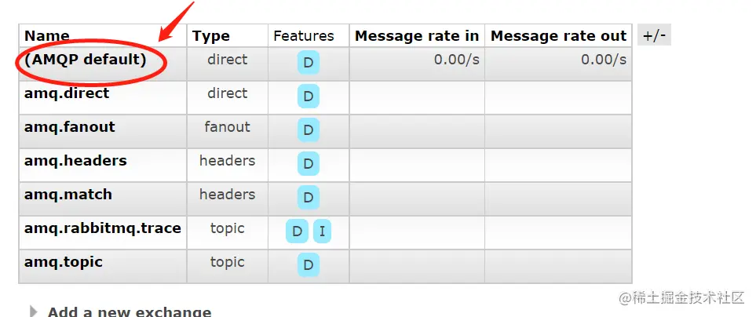
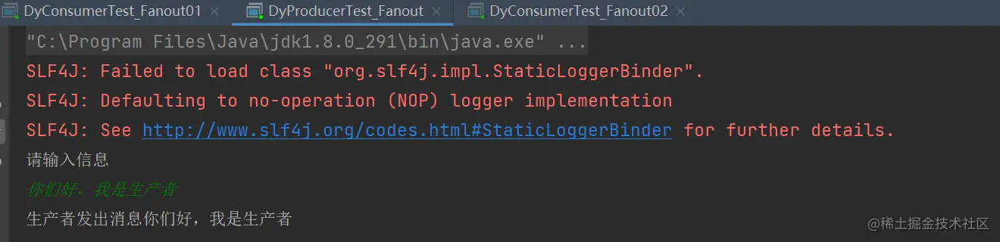

### 前言

- 回顾一下简单模式和工作模式

  - 简单模式：一个生产者对应一个消费者。
  - 工作模式：一个生产者对应多个消费者。

- 现在来介绍一下交换机是干嘛的

- RabbitMQ 消息传递模型的核心思想是: 生产者生产的消息从不会直接发送到队列。实际上，通常生产 者甚至都不知道这些消息传递传递到了哪些队列中。

- 相反，生产者只能将消息发送到交换机(exchange)，交换机工作的内容非常简单，一方面它接收来 自生产者的消息，另一方面将它们推入队列。交换机必须确切知道如何处理收到的消息。

- 是应该把这些消 息放到特定队列还是说把他们到许多队列中还是说应该丢弃它们。这就的由交换机的类型来决定。

- 

- 交换机共有四种类型

  - 直接(direct)
  - 主题(topic)
  - 标题(headers)
  - 扇出(fanout)
  - 一般MQ会帮我们创建一些默认的交换机，可以直接拿来使用，也可以自己创建不同类型的交换机
  - 

- 这里需要讲下无名交换机，也就是默认交换机，先前的几篇文章我们都没有指定交换机

  - 
  - 第一个参数是交换机的名称。空字符串表示默认或无名称交换机：消息能路由发送到队列中其实 是由 routingKey(bindingkey)绑定 key 指定的，如果它存在的话。
  - 那么这种情况下，MQ会走默认的交换机（AMQP default）
  - 

- 还有东西叫临时队列

  - ```ini
    ini复制代码//创建临时队列
    String queueName = channel.queueDeclare().getQueue();
    ```

  - 

  - 直接执行肯定报错的：明显告诉我们队列名不要用amq来命名，所以可以将代码稍微改造下

  - 

  - ```csharp
    csharp
    复制代码channel.queueDeclare("dy"+queueName,false,false,false,null);
    ```

  - 

- 了解了交换机之后，我们就可以正式开始发布订阅模式啦~

### 一、生产者

- 尽量在生产者指定交换机，毕竟按照正常逻辑来看，肯定是先发送，才能接受。否则的话接受了个寂寞哦~

- ```csharp
  csharp复制代码    public static void publishMessageIndividually() throws Exception {
          //工具类获取通道
          Channel channel = RabbitMqUtils.getChannel();
          /**
           * 指定交换机和模式
           * 参数一：指定的交换机名称
           * 参数二：指定的交换机模式
           */
          channel.exchangeDeclare(ChangeNameConstant.FANOUT_MODEL,"fanout");
  
          Scanner sc = new Scanner(System.in);
          System.out.println("请输入信息");
          while (sc.hasNext()) {
              String message = sc.nextLine();
              channel.basicPublish(ChangeNameConstant.FANOUT_MODEL, "20210804", null, message.getBytes("UTF-8"));
              System.out.println("生产者发出消息" + message);
          }
      }
  ```

- 

- 由此可见

  - 创建了一个生产者
  - 建立了一个交换机Name= fanout_pattern
  - 交换机的类型是 fanout（扇型）

### 二、消费者

- 消费者A

- ```java
  java复制代码/**
   * 这是一个测试的消费者
   *@author DingYongJun
   *@date 2021/8/1
   */
  public class DyConsumerTest_Fanout01 {
  
      public static void main(String[] args) throws Exception{
          //使用工具类来创建通道
          Channel channel = RabbitMqUtils.getChannel();
  
          /**
           * 生成一个临时的队列 队列的名称是随机的
           * 当消费者断开和该队列的连接时 队列自动删除
           */
          String queueName = channel.queueDeclare().getQueue();
          //把该临时队列绑定我们的 exchange 其中 routingkey(也称之为 binding key)为空字符串
          channel.queueBind(queueName, ChangeNameConstant.FANOUT_MODEL, "20210804");
          System.out.println("交换机A等待接收消息,把接收到的消息打印在屏幕.....");
          DeliverCallback deliverCallback = (consumerTag, delivery) -> {
              String message = new String(delivery.getBody(), "UTF-8");
              System.out.println("控制台打印接收到的消息"+message);
          };
          channel.basicConsume(queueName, true, deliverCallback, consumerTag -> {
              System.out.println("消息中断了~");
          });
      }
  }
  ```

- 消费者B代码一样，只是改成消费者B等待接受消息~

- 

- 两个消费者的申明的临时队列成功绑定到了交换机上！

- 执行结果

  - 生产者
  - 
  - 消费者A
  - 
  - 消费者B
  - 

- 生产者给交换机发了一条消息。

- 两个消费者都收到了消息。

### 三、总结

- 
- 很明显，这个地方我们不会将消息直接发到队列了
- 而是将消息发送给交换机
- 交换机寻找哪些队列绑定了本交换机
- 然后将消息发送至所有被绑定的队列
- 最终队列发送消息给消费者