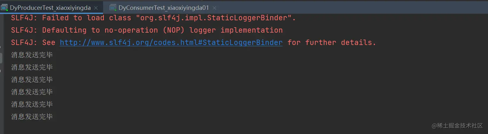
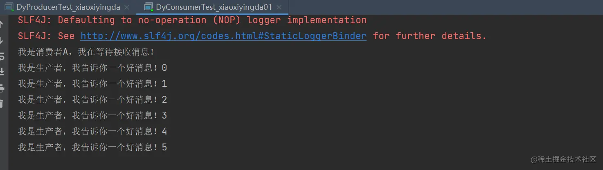
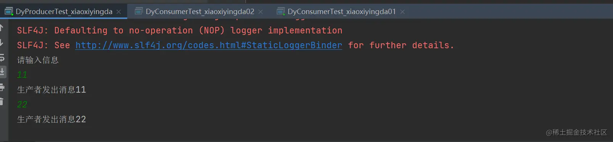
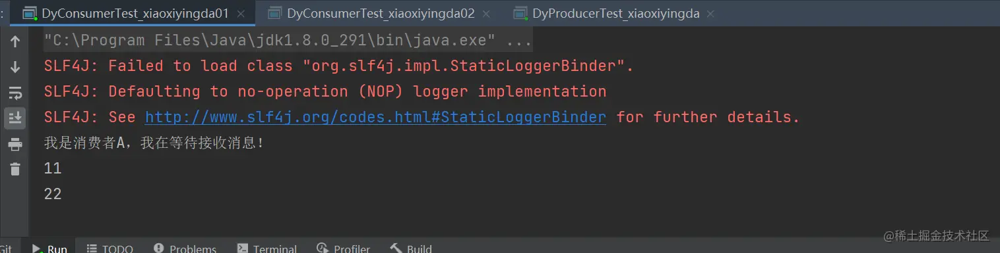
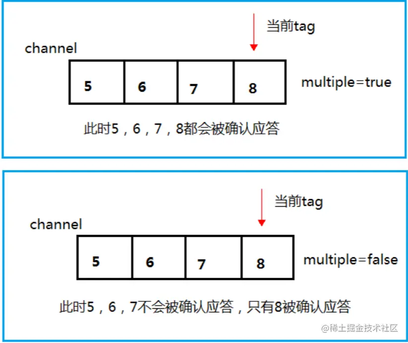
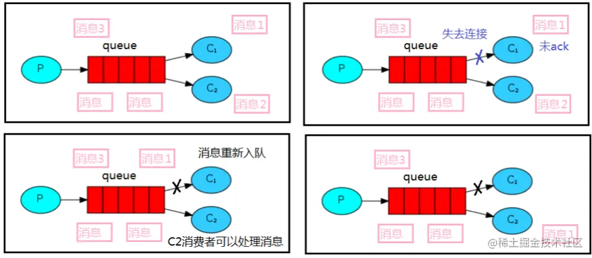

### 前言

- 开始消息应答之前先思考几个问题
- 消费者完成一个任务可能需要一段时间，如果其中一个消费者处理一个长的任务并仅只完成 了部分突然它挂掉了，会发生什么情况？
- RabbitMQ 一旦向消费者传递了一条消息，便立即将该消 息标记为删除。在这种情况下，突然有个消费者挂掉了，我们将丢失正在处理的消息。以及后续 发送给该消费这的消息，因为它无法接收到。
- 为了保证消息在发送过程中不丢失，rabbitmq 引入消息应答机制，消息应答就是
  - **消费者在接 收到消息并且处理该消息之后，告诉 rabbitmq 它已经处理了，rabbitmq 可以把该消息删除了。**

### 一、自动应答(不建议使用)

- 消息发送后立即被认为已经传送成功，这种模式需要在高吞吐量和数据传输安全性方面做权 衡,因为这种模式如果消息在接收到之前，消费者那边出现连接或者 channel 关闭，那么消息就丢 失了。
- 当然另一方面这种模式消费者那边可以传递过载的消息，没有对传递的消息数量进行限制， 当然这样有可能使得消费者这边由于接收太多还来不及处理的消息，导致这些消息的积压，最终 使得内存耗尽，最终这些消费者线程被操作系统杀死。
- 所以这种模式仅适用在消费者可以高效并 以某种速率能够处理这些消息的情况下使用。

#### ①、生产者

- ```java
  java复制代码/**
   * 这是一个测试的生产者
   *@author DingYongJun
   *@date 2021/8/1
   */
  public class DyProducerTest_xiaoxiyingda {
      /**
       * 这里为了方便，我们使用main函数来测试
       * 纯属看你个人选择
       * @param args
       */
      public static void main(String[] args) throws Exception{
          //使用工具类来创建通道
          Channel channel = RabbitMqUtils.getChannel();
  
          /**
           * 生成一个队列
           * 1.队列名称
           * 2.队列里面的消息是否持久化 默认消息存储在内存中
           * 3.该队列是否只供一个消费者进行消费 是否进行共享 true 可以多个消费者消费
           * 4.是否自动删除 最后一个消费者端开连接以后 该队列是否自动删除 true 自动删除
           * 5.其他参数
           */
          channel.queueDeclare(QueueNameConstant.XIAOXIYINGDA_MODEL,false,false,false,null);
  
          /**
           * 发送一个消息
           * 1.发送到那个交换机
           * 2.路由的 key 是哪个
           * 3.其他的参数信息
           * 4.发送消息的消息体
           */
          for (int i=0;i<6;i++){
              String message="我是生产者，我告诉你一个好消息！"+i;
              Thread.sleep( 1000 );
              channel.basicPublish("",QueueNameConstant.XIAOXIYINGDA_MODEL,null,message.getBytes());
              System.out.println("消息发送完毕");
          }
      }
  
  }
  ```

#### ②、消费者

- ```java
  java复制代码/**
   * 这是一个测试的消费者
   *@author DingYongJun
   *@date 2021/8/1
   */
  public class DyConsumerTest_xiaoxiyingda01 {
  
      public static void main(String[] args) throws Exception{
          //使用工具类来创建通道
          Channel channel = RabbitMqUtils.getChannel();
  
          System.out.println("我是消费者A，我在等待接收消息！");
          DeliverCallback deliverCallback = (String var1, Delivery var2)->{
              String message= new String(var2.getBody());
              System.out.println(message);
          };
          CancelCallback cancelCallback = (String var1)->{
              System.out.println("消息消费被中断");
          };
  
          /**
           * 消费者消费消息
           * 1.消费哪个队列
           * 2.消费成功之后是否要自动应答 true 代表自动应答 false 手动应答
           * 3.消费者未成功消费的回调
           */
          Thread.sleep(1000);
          channel.basicConsume(QueueNameConstant.XIAOXIYINGDA_MODEL,true,deliverCallback,cancelCallback);
      }
  }
  ```

#### ③、测试

- 执行结果

  - 
  - 

- 结论

  - ```java
    java复制代码    public String basicConsume(String queue, boolean autoAck, DeliverCallback deliverCallback, CancelCallback cancelCallback) throws IOException {
            return this.basicConsume(queue, autoAck, "", this.consumerFromDeliverCancelCallbacks(deliverCallback, cancelCallback));
        }
    ```

  - 当autoAck为true时，为自动应答

  - 当autoAck为false时，为手动应答

- 不建议使用自动应答，实际业务场景中，一般我们使用手动应答。

### 二、手动应答(建议使用)

- 生产者

  - ```java
    java复制代码/**
     * 这是一个测试的生产者
     *@author DingYongJun
     *@date 2021/8/1
     */
    public class DyProducerTest_xiaoxiyingda {
        /**
         * 这里为了方便，我们使用main函数来测试
         * 纯属看你个人选择
         * @param args
         */
        public static void main(String[] args) throws Exception{
            //使用工具类来创建通道
            Channel channel = RabbitMqUtils.getChannel();
    
            /**
             * 生成一个队列
             * 1.队列名称
             * 2.队列里面的消息是否持久化 默认消息存储在内存中
             * 3.该队列是否只供一个消费者进行消费 是否进行共享 true 可以多个消费者消费
             * 4.是否自动删除 最后一个消费者端开连接以后 该队列是否自动删除 true 自动删除
             * 5.其他参数
             */
            channel.queueDeclare(QueueNameConstant.XIAOXIYINGDA_MODEL,false,false,false,null);
    
            /**
             * 发送一个消息
             * 1.发送到那个交换机
             * 2.路由的 key 是哪个
             * 3.其他的参数信息
             * 4.发送消息的消息体
             */
            Scanner sc = new Scanner(System.in);
            System.out.println("请输入信息");
            while (sc.hasNext()) {
                String message = sc.nextLine();
                channel.basicPublish("",QueueNameConstant.XIAOXIYINGDA_MODEL,null,message.getBytes());
                System.out.println("生产者发出消息" + message);
            }
        }
    
    }
    ```

- 消费者A

  - ```java
    java复制代码/**
     * 这是一个测试的消费者
     *@author DingYongJun
     *@date 2021/8/1
     */
    public class DyConsumerTest_xiaoxiyingda01 {
    
        public static void main(String[] args) throws Exception{
            //使用工具类来创建通道
            Channel channel = RabbitMqUtils.getChannel();
    
            System.out.println("我是消费者A，我在等待接收消息！");
            DeliverCallback deliverCallback = (String var1, Delivery var2)->{
                String message= new String(var2.getBody());
                try {
                    Thread.sleep(1000);
                } catch (InterruptedException e) {
                    e.printStackTrace();
                }
                System.out.println(message);
                //true 代表批量应答 channel 上未应答的消息  false 单条应答
                boolean multiple = false;
                channel.basicAck(var2.getEnvelope().getDeliveryTag(),multiple);
            };
            CancelCallback cancelCallback = (String var1)->{
                System.out.println("消息消费被中断");
            };
    
            /**
             * 消费者消费消息
             * 1.消费哪个队列
             * 2.消费成功之后是否要自动应答 true 代表自动应答 false 手动应答
             * 3.消费者未成功消费的回调
             */
            channel.basicConsume(QueueNameConstant.XIAOXIYINGDA_MODEL,false,deliverCallback,cancelCallback);
        }
    }
    ```

  - 设置手动应答，设置休眠时间较短，表示处理业务非常快。

- 消费者B

  - ```java
    java复制代码/**
     * 这是一个测试的消费者
     *@author DingYongJun
     *@date 2021/8/1
     */
    public class DyConsumerTest_xiaoxiyingda02 {
    
        public static void main(String[] args) throws Exception{
            //使用工具类来创建通道
            Channel channel = RabbitMqUtils.getChannel();
    
            System.out.println("我是消费者B，我在等待接收消息！");
            DeliverCallback deliverCallback = (String var1, Delivery var2)->{
                String message= new String(var2.getBody());
                try {
                    Thread.sleep(30000);
                } catch (InterruptedException e) {
                    e.printStackTrace();
                }
                System.out.println(message);
                //true 代表批量应答 channel 上未应答的消息  false 单条应答
                boolean multiple = false;
                channel.basicAck(var2.getEnvelope().getDeliveryTag(),multiple);
            };
            CancelCallback cancelCallback = (String var1)->{
                System.out.println("消息消费被中断");
            };
    
            /**
             * 消费者消费消息
             * 1.消费哪个队列
             * 2.消费成功之后是否要自动应答 true 代表自动应答 false 手动应答
             * 3.消费者未成功消费的回调
             */
            channel.basicConsume(QueueNameConstant.XIAOXIYINGDA_MODEL,false,deliverCallback,cancelCallback);
        }
    }
    ```

  - 设置手动应答，设置休眠时间较长，表示处理业务较慢。

- 执行顺序

  - 1、控制台分别发送两条消息
  - 2、理论上AB各一条消息，如果这个时候B还未处理完就断开连接了，那么消息怎么办？

- 执行结果

  - 
  - 

### 三、总结

- multiple 的 true 和 false 代表不同意思
  - ture 表示批量应答，是以通道为单位的，比如你一个完成了，我就会应答全部完成。效率高，但是不安全。
  - false表示单个应答，完成一个我应答一个。较为安全靠谱。但是效率较低。
  - 
- 消息自动重新入队
  - 如果消费者由于某些原因失去连接(其通道已关闭，连接已关闭或 TCP 连接丢失)，导致消息 未发送 ACK 确认，RabbitMQ 将了解到消息未完全处理，并将对其重新排队。
  - 如果此时其他消费者 可以处理，它将很快将其重新分发给另一个消费者。这样，即使某个消费者偶尔死亡，也可以确 保不会丢失任何消息。
  - 