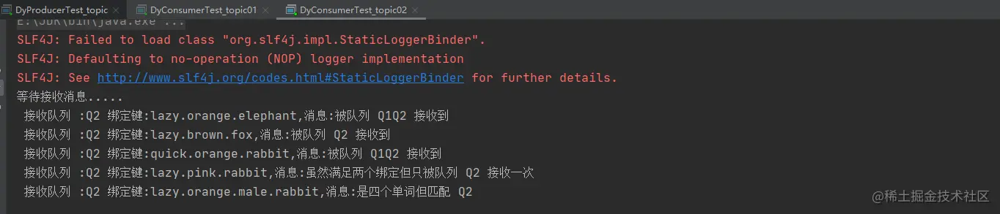

### 前言

- 比方说我们想接收的日志类型有info.base 和 info.advantage，某个队列只想 info.base 的消息，那这个时候 direct 就办不到了。
- 这个时候就只能使用 topic 类型。
- 发送到类型是 topic 交换机的消息的 routing_key 不能随意写，必须满足一定的要求，它**必须是一个单词列表，以点号分隔开**。
- 这些单词可以是任意单词，比如说："stock.usd.nyse", "nyse.vmw", "quick.orange.rabbit".这种类型的。
- 当然这个单词列表最多不能超过 255 个字节。
- 规则列表
  - *（星号）可以代替一个单词
  - \#（井号）可以代替零个或多个单词

### 一、生产者

- ```arduino
  arduino复制代码/**
   * 这是一个测试的生产者
   *@author DingYongJun
   *@date 2021/8/6
   */
  public class DyProducerTest_topic {
  
      private static final String EXCHANGE_NAME = "topic_logs";
      /**
       * 这里为了方便，我们使用main函数来测试
       * 纯属看你个人选择
       * @param args
       */
      public static void main(String[] args) throws Exception {
          publishMessageIndividually();
      }
  
      public static void publishMessageIndividually() throws Exception {
          //使用工具类来创建通道
          Channel channel = RabbitMqUtils.getChannel();
          /**
           * Q1-->绑定的是
           * 中间带 orange 带 3 个单词的字符串(*.orange.*)
           * Q2-->绑定的是
           * 最后一个单词是 rabbit 的 3 个单词(*.*.rabbit)
           * 第一个单词是 lazy 的多个单词(lazy.#)
           *
           */
          Map<String, String> bindingKeyMap = new HashMap<>();
          bindingKeyMap.put("quick.orange.rabbit", "被队列 Q1Q2 接收到");
          bindingKeyMap.put("lazy.orange.elephant", "被队列 Q1Q2 接收到");
          bindingKeyMap.put("quick.orange.fox", "被队列 Q1 接收到");
          bindingKeyMap.put("lazy.brown.fox", "被队列 Q2 接收到");
          bindingKeyMap.put("lazy.pink.rabbit", "虽然满足两个绑定但只被队列 Q2 接收一次");
          bindingKeyMap.put("quick.brown.fox", "不匹配任何绑定不会被任何队列接收到会被丢弃");
          bindingKeyMap.put("quick.orange.male.rabbit", "是四个单词不匹配任何绑定会被丢弃");
          bindingKeyMap.put("lazy.orange.male.rabbit", "是四个单词但匹配 Q2");
  
          for (Map.Entry<String, String> bindingKeyEntry: bindingKeyMap.entrySet()){
              String bindingKey = bindingKeyEntry.getKey();
              String message = bindingKeyEntry.getValue();
              channel.basicPublish(EXCHANGE_NAME,bindingKey, null,
                      message.getBytes("UTF-8"));
              System.out.println("生产者发出消息" + message);
          }
      }
  }
  ```

- 

### 二、消费者

- A

  - ```java
    java复制代码/**
     * 这是一个测试的消费者
     *
     * @author DingYongJun
     * @date 2021/8/6
     */
    public class DyConsumerTest_topic01 {
    
        private static final String EXCHANGE_NAME = "topic_logs";
    
        public static void main(String[] args) throws Exception {
                Channel channel = RabbitMqUtils.getChannel();
                channel.exchangeDeclare(EXCHANGE_NAME, "topic");
                //声明 Q1 队列与绑定关系
                String queueName="Q1";
                channel.queueDeclare(queueName, false, false, false, null);
                channel.queueBind(queueName, EXCHANGE_NAME, "*.orange.*");
                System.out.println("等待接收消息.....");
                DeliverCallback deliverCallback = (consumerTag, delivery) -> {
                    String message = new String(delivery.getBody(), "UTF-8");
                    System.out.println(" 接收队列 :"+queueName+" 绑定键:"+delivery.getEnvelope().getRoutingKey()+",消息:"+message);
                };
                channel.basicConsume(queueName, true, deliverCallback, consumerTag -> {
                });
            }
    }
    ```

- B

  - ```java
    java复制代码/**
     * 这是一个测试的消费者
     *@author DingYongJun
     *@date 2021/8/1
     */
    public class DyConsumerTest_topic02 {
        private static final String EXCHANGE_NAME = "topic_logs";
        public static void main(String[] args) throws Exception{
            Channel channel = RabbitMqUtils.getChannel();
            channel.exchangeDeclare(EXCHANGE_NAME, "topic");
            //声明 Q2 队列与绑定关系
            String queueName="Q2";
            channel.queueDeclare(queueName, false, false, false, null);
            channel.queueBind(queueName, EXCHANGE_NAME, "*.*.rabbit");
            channel.queueBind(queueName, EXCHANGE_NAME, "lazy.#");
            System.out.println("等待接收消息.....");
            DeliverCallback deliverCallback = (consumerTag, delivery) -> {
                String message = new String(delivery.getBody(), "UTF-8");
                System.out.println(" 接收队列 :"+queueName+" 绑定键:"+delivery.getEnvelope().getRoutingKey()+",消息:"+message);
            };
            channel.basicConsume(queueName, true, deliverCallback, consumerTag -> {
            });
        }
    }
    ```

- 执行结果

  - 
  - 生产者
  - 
  - 消费者A
  - 
  - 消费者B
  - 

### 三、总结

- 
- 当一个队列绑定键是#,那么这个队列将接收所有数据，就有点像 fanout 了。
- 如果队列绑定键当中没有`#`和`*`出现，那么这玩意绑定的类型就是direct了。
- 所以说topic才是最灵活的模式！加上异步应答。也是我们工作中使用最多的模式！