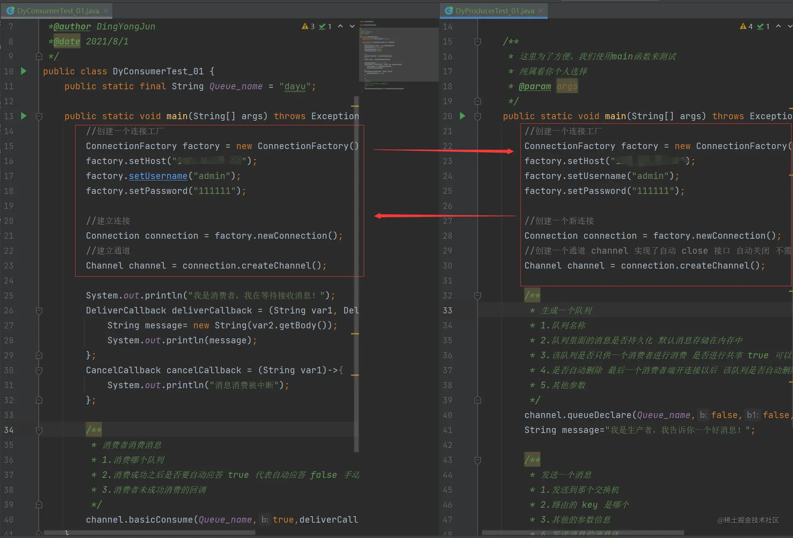
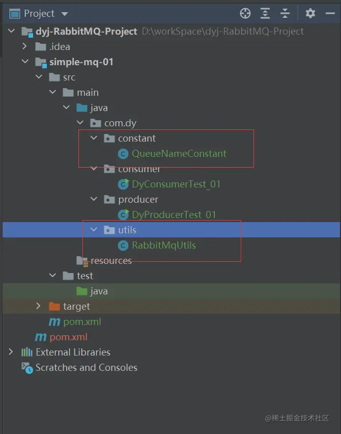
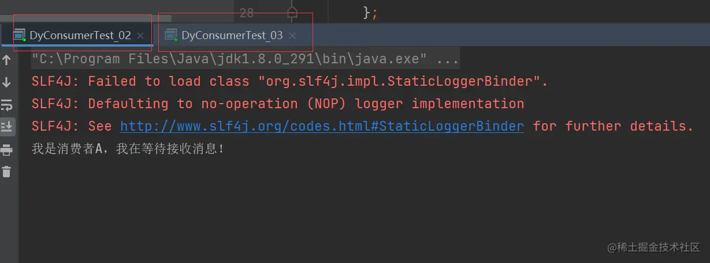
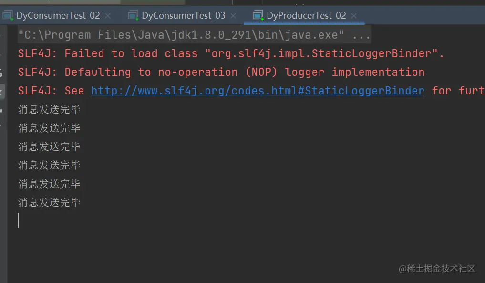
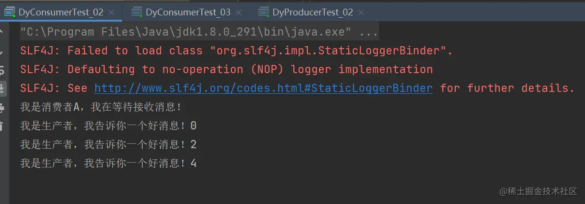
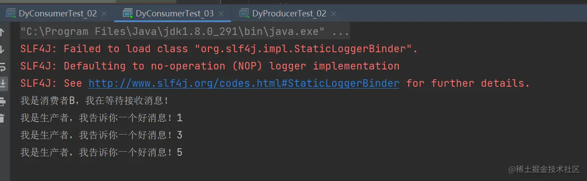
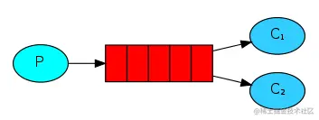

### 前言

- 工作队列(又称任务队列)的主要思想是避免立即执行资源密集型任务，而不得不等待它完成。

- 相反我们安排任务在之后执行。我们把任务封装为消息并将其发送到队列。

- 在后台运行的工作进 程将弹出任务并最终执行作业。

- 当有多个工作线程时，这些工作线程将一起处理这些任务。

- 作为一名将来的高级程序员，我们先将之前的简单队列模式来进行一定的优化。

  - 这是我们的生产者和消费者，显而易见，大量的重复代码。
  - 

- 优化

  - 先将队列名抽取出来

  - ```arduino
    arduino复制代码public class QueueNameConstant {
    
        //简单队列模式
        public static final String JIANDAN_MODEL = "dayu";
    
        //工作队列模式
        public static final String WORK_MODEL = "work_model";
    }
    ```

  - 抽取连接工厂、建立连接、建立通道

  - ```java
    java复制代码/**
     * 公用部分创建工具类
     *@author DingYongJun
     *@date 2021/8/1
     */
    public class RabbitMqUtils {
        //得到一个连接的 channel
        public static Channel getChannel() throws Exception {
            //创建一个连接工厂
            ConnectionFactory factory = new ConnectionFactory();
            factory.setHost("ip地址");
            factory.setUsername("admin");
            factory.setPassword("111111");
            Connection connection = factory.newConnection();
            Channel channel = connection.createChannel();
            return channel;
        }
    }
    ```

  - 大致结构这样

  - 

- nice！然后想怎么用就怎么用吧！

### 一、生产者

- ```php
  php复制代码/**
   * 这是一个测试的生产者
   *@author DingYongJun
   *@date 2021/8/1
   */
  public class DyProducerTest_02 {
      /**
       * 这里为了方便，我们使用main函数来测试
       * 纯属看你个人选择
       * @param args
       */
      public static void main(String[] args) throws Exception{
          //使用工具类来创建通道
          Channel channel = RabbitMqUtils.getChannel();
  
          /**
           * 生成一个队列
           * 1.队列名称
           * 2.队列里面的消息是否持久化 默认消息存储在内存中
           * 3.该队列是否只供一个消费者进行消费 是否进行共享 true 可以多个消费者消费
           * 4.是否自动删除 最后一个消费者端开连接以后 该队列是否自动删除 true 自动删除
           * 5.其他参数
           */
          channel.queueDeclare(QueueNameConstant.WORK_MODEL,false,false,false,null);
  
  
          /**
           * 发送一个消息
           * 1.发送到那个交换机
           * 2.路由的 key 是哪个
           * 3.其他的参数信息
           * 4.发送消息的消息体
           */
          for (int i=0;i<6;i++){
              String message="我是生产者，我告诉你一个好消息！"+i;
              Thread.sleep( 1000 );
              channel.basicPublish("",QueueNameConstant.WORK_MODEL,null,message.getBytes());
              System.out.println("消息发送完毕");
          }
      }
  
  }
  ```

### 二、消费者

- 为了测试`轮训分发消息`，这里我们建两个消费者进行消费消息。

- 消费者A

- ```ini
  ini复制代码/**
   * 这是一个测试的消费者
   *@author DingYongJun
   *@date 2021/8/1
   */
  public class DyConsumerTest_02 {
  
      public static void main(String[] args) throws Exception{
          //使用工具类来创建通道
          Channel channel = RabbitMqUtils.getChannel();
  
          System.out.println("我是消费者A，我在等待接收消息！");
          DeliverCallback deliverCallback = (String var1, Delivery var2)->{
              String message= new String(var2.getBody());
              System.out.println(message);
          };
          CancelCallback cancelCallback = (String var1)->{
              System.out.println("消息消费被中断");
          };
  
          /**
           * 消费者消费消息
           * 1.消费哪个队列
           * 2.消费成功之后是否要自动应答 true 代表自动应答 false 手动应答
           * 3.消费者未成功消费的回调
           */
          Thread.sleep(1000);
          channel.basicConsume(QueueNameConstant.WORK_MODEL,true,deliverCallback,cancelCallback);
      }
  }
  ```

- 消费者B代码一致，不再粘贴出来占用篇幅！

- 将消费者A、B都启动起来

  - 

- 启动生产者，发送六条消息

  - 

- 消费者A

  - 

- 消费者B

  - 

- 结果很明显，你一条，我一条，大家非常有顺序的一人一条！没有发生混乱抢劫啥的。哈哈哈

### 三、总结

- 
- **轮询分发就是将消息队列中的消息，依次发送给所有消费者。一个消息只能被一个消费者获取。**
- 特点
  - 一条消息只会被一个消费端接收。
  - 队列采用轮询的方式将消息是平均发送给消费者的。
  - 消费者在处理完某条消息后，才会收到下一条消息。
- 生产端
  - 声明队列
  - 创建连接
  - 创建通道
  - 通道声明队列
  - 制定消息
- 消费端
  - 声明队列
  - 创建连接
  - 创建通道
  - 通道声明队列
  - 重写消息消费方法
  - 执行消息方法