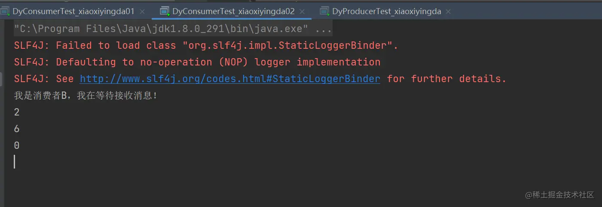
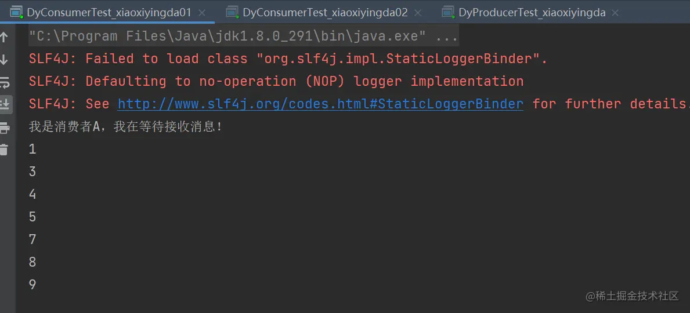
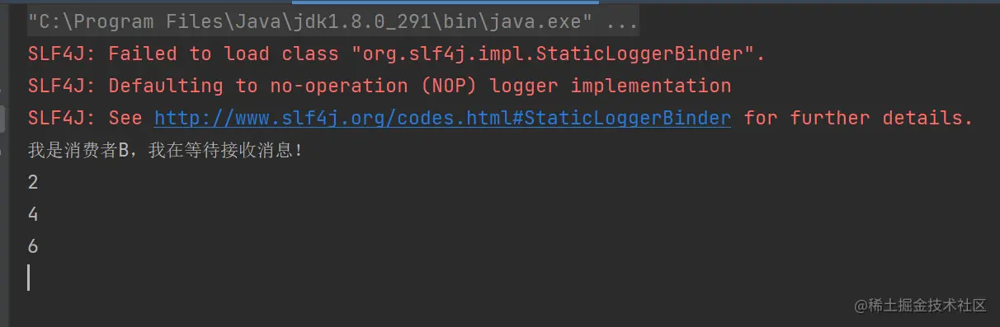
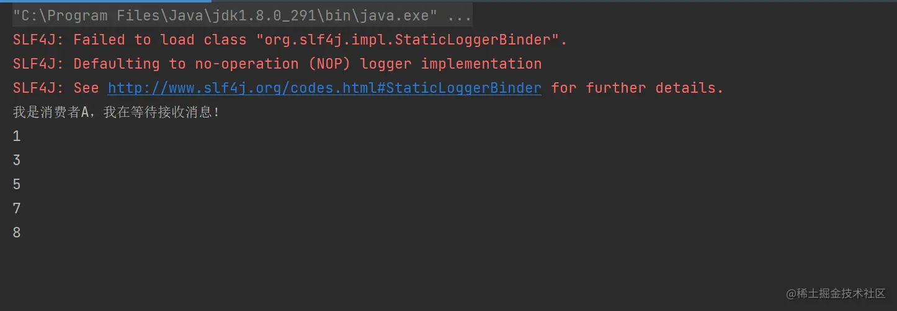

### 前言

- 在最开始的时候我们学习到 RabbitMQ 分发消息采用的轮训分发，但是在某种场景下这种策略并不是很好。
- 比方说有两个消费者在处理任务，其中有个消费者 A 处理任务的速度非常快，而另外一个消费者 B 处理速度却很慢，这个时候我们还是采用轮训分发的化就会到这处理速度快的这个消费者很大一部分时间 处于空闲状态，而处理慢的那个消费者一直在干活。
- 这种分配方式在这种情况下其实就不太好，但是 RabbitMQ 并不知道这种情况它依然很公平的进行分发。
- 这个时候我们可以使用不公平分发来实现，就是能者多劳模式！你能干，哦，那你就多干点活吧。我比较菜，所以我少干点活。

### 一、不公平分发

- 生产者

  - ```java
    java复制代码/**
     * 这是一个测试的生产者
     *@author DingYongJun
     *@date 2021/8/1
     */
    public class DyProducerTest_xiaoxiyingda {
        /**
         * 这里为了方便，我们使用main函数来测试
         * 纯属看你个人选择
         * @param args
         */
        public static void main(String[] args) throws Exception{
            //使用工具类来创建通道
            Channel channel = RabbitMqUtils.getChannel();
    
            /**
             * 生成一个队列
             * 1.队列名称
             * 2.队列里面的消息是否持久化 默认消息存储在内存中
             * 3.该队列是否只供一个消费者进行消费 是否进行共享 true 可以多个消费者消费
             * 4.是否自动删除 最后一个消费者端开连接以后 该队列是否自动删除 true 自动删除
             * 5.其他参数
             */
            //这是持久化的参数。false不进行持久化，true进行持久化
            boolean durable = true;
            channel.queueDeclare(QueueNameConstant.XIAOXIYINGDA_MODEL,durable,false,false,null);
    
            /**
             * 发送一个消息
             * 1.发送到那个交换机
             * 2.路由的 key 是哪个
             * 3.其他的参数信息
             * 4.发送消息的消息体
             */
            Scanner sc = new Scanner(System.in);
            System.out.println("请输入信息");
            while (sc.hasNext()) {
                String message = sc.nextLine();
                //MessageProperties.PERSISTENT_TEXT_PLAIN;这个代表消息持久化到硬盘
                channel.basicPublish("",QueueNameConstant.XIAOXIYINGDA_MODEL,MessageProperties.PERSISTENT_TEXT_PLAIN,message.getBytes());
                System.out.println("生产者发出消息" + message);
            }
        }
    }
    ```

- 消费者

  - ```java
    java复制代码/**
     * 这是一个测试的消费者
     *@author DingYongJun
     *@date 2021/8/1
     */
    public class DyConsumerTest_xiaoxiyingda01 {
    
        public static void main(String[] args) throws Exception{
            //使用工具类来创建通道
            Channel channel = RabbitMqUtils.getChannel();
    
            System.out.println("我是消费者A，我在等待接收消息！");
            DeliverCallback deliverCallback = (String var1, Delivery var2)->{
                String message= new String(var2.getBody());
                try {
                    Thread.sleep(1000);
                } catch (InterruptedException e) {
                    e.printStackTrace();
                }
                System.out.println(message);
                //true 代表批量应答 channel 上未应答的消息  false 单条应答
                boolean multiple = false;
                channel.basicAck(var2.getEnvelope().getDeliveryTag(),multiple);
            };
            CancelCallback cancelCallback = (String var1)->{
                System.out.println("消息消费被中断");
            };
            //不公平分发
            int prefetchCount = 1;
            channel.basicQos(prefetchCount);
            /**
             * 消费者消费消息
             * 1.消费哪个队列
             * 2.消费成功之后是否要自动应答 true 代表自动应答 false 手动应答
             * 3.消费者未成功消费的回调
             */
            channel.basicConsume(QueueNameConstant.XIAOXIYINGDA_MODEL,false,deliverCallback,cancelCallback);
        }
    }
    ```

  - ```java
    java复制代码/**
     * 这是一个测试的消费者
     *@author DingYongJun
     *@date 2021/8/1
     */
    public class DyConsumerTest_xiaoxiyingda02 {
    
        public static void main(String[] args) throws Exception{
            //使用工具类来创建通道
            Channel channel = RabbitMqUtils.getChannel();
    
            System.out.println("我是消费者B，我在等待接收消息！");
            DeliverCallback deliverCallback = (String var1, Delivery var2)->{
                String message= new String(var2.getBody());
                try {
                    Thread.sleep(3000);
                } catch (InterruptedException e) {
                    e.printStackTrace();
                }
                System.out.println(message);
                //true 代表批量应答 channel 上未应答的消息  false 单条应答
                boolean multiple = false;
                channel.basicAck(var2.getEnvelope().getDeliveryTag(),multiple);
            };
            CancelCallback cancelCallback = (String var1)->{
                System.out.println("消息消费被中断");
            };
    
            //不公平分发
            int prefetchCount = 1;
            channel.basicQos(prefetchCount);
    
            /**
             * 消费者消费消息
             * 1.消费哪个队列
             * 2.消费成功之后是否要自动应答 true 代表自动应答 false 手动应答
             * 3.消费者未成功消费的回调
             */
            channel.basicConsume(QueueNameConstant.XIAOXIYINGDA_MODEL,false,deliverCallback,cancelCallback);
        }
    }
    ```

  - 执行结果

    - 
    - 
    - 

  - 由结果可以得出一定的结论

    - 明显A执行了7条，B执行了3条。
    - 两个消费者都设置了不公平分发模式。
    - 当A消费者效率快（即一秒执行完），B消费者效率慢（三秒执行完）。
    - MQ会自动判断谁干的快，然后给干的快的人分配的多。
    - 其实本质上就是不休息呀。干完了就继续来领新的任务！
    - 生产队的驴都不敢这么压榨吧！哈哈~

  - 意思就是如果这个任务我还没有处理完或者我还没有应答你，你先别分配给我，我目前只能处理一个 任务。

  - 然后 rabbitmq 就会把该任务分配给没有那么忙的那个空闲消费者，当然如果所有的消费者都没有完 成手上任务。

  - 队列还在不停的添加新任务，队列有可能就会遇到队列被撑满的情况，这个时候就只能添加 新的 worker 或者改变其他存储任务的策略。

  - 设置代码：

    - ```java
      java复制代码//不公平分发
      int prefetchCount = 1;
      channel.basicQos(prefetchCount);
      ```

    - ```java
      java复制代码//源码为证    
      public void basicQos(int prefetchCount) throws IOException {
              this.basicQos(0, prefetchCount, false);
          }
      ```

    - int 默认值是0  这个不用解释吧。也就是我们不设置，这个值就是零。

    - 设置为1时证明启动了不公平分发模式。

### 二、预取值分发

- 本身消息的发送就是异步发送的，所以在任何时候，channel 上肯定不止只有一个消息另外来自消费 者的手动确认本质上也是异步的。

- 因此这里就存在一个未确认的消息缓冲区，因此希望开发人员能限制此缓冲区的大小，以避免缓冲区里面无限制的未确认消息问题。

- 当然这将使吞吐量变得很低，特别是消费者连接延迟很严重的情况下，特别是在消费者连接等待时间较长的环境中。对于大多数应用来说，稍微高一点的值将是最佳的。

- 生产者和上面的例子保持一致即可。无需改动

- 消费者

  - ```java
    java复制代码/**
     * 这是一个测试的消费者
     *@author DingYongJun
     *@date 2021/8/1
     */
    public class DyConsumerTest_xiaoxiyingda01 {
    
        public static void main(String[] args) throws Exception{
            //使用工具类来创建通道
            Channel channel = RabbitMqUtils.getChannel();
    
            System.out.println("我是消费者A，我在等待接收消息！");
            DeliverCallback deliverCallback = (String var1, Delivery var2)->{
                String message= new String(var2.getBody());
                try {
                    Thread.sleep(1000);
                } catch (InterruptedException e) {
                    e.printStackTrace();
                }
                System.out.println(message);
                //true 代表批量应答 channel 上未应答的消息  false 单条应答
                boolean multiple = false;
                channel.basicAck(var2.getEnvelope().getDeliveryTag(),multiple);
            };
            CancelCallback cancelCallback = (String var1)->{
                System.out.println("消息消费被中断");
            };
            //不公平分发
            int prefetchCount = 5;
            channel.basicQos(prefetchCount);
            /**
             * 消费者消费消息
             * 1.消费哪个队列
             * 2.消费成功之后是否要自动应答 true 代表自动应答 false 手动应答
             * 3.消费者未成功消费的回调
             */
            channel.basicConsume(QueueNameConstant.XIAOXIYINGDA_MODEL,false,deliverCallback,cancelCallback);
        }
    }
    ```

  - 消费者B代码一致，就是休眠时间加长点，prefetchCount的值设置为3，方便看出来区别。

- 执行结果

  - 
  - 
  - 

- 由以上的结果可以得出结论

  - prefetchCount，这个值设置为3时，表示当前通道内，最多只有三条进来，再多就在外面排队。
  - 也就是说，当我们发完八条数据时，A有5条，B有3条。再来一条时，谁先消费完一条，新的就被谁去消费。
  - 如果队列中一直有数据进入。那么会AB消费者会被一直补充消息。会保持满prefetchCount值的消息数在通道内。


**作用**：通过使用预取值和手动确认消息的方式，可以实现更细粒度的消息控制和处理，并发挥RabbitMQ的强大功能。