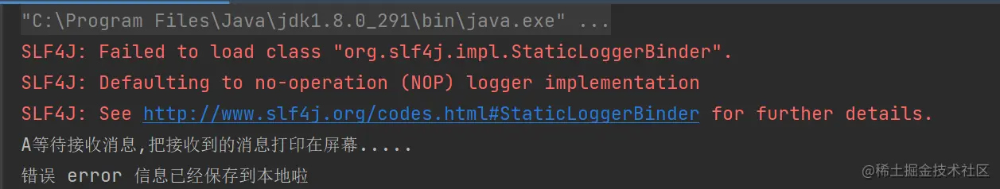

### 前言

- 模拟一个场景
  - 现在有三种级别的日志 info、wearing、error
  - 现在想把error日志给保存到本地， info和wearing直接丢弃掉（就是直接消费，不作任何处理，不消费也不行呀，就形成积压了）
  - 这样一想，我们是不是可以定义一个消费者绑定专门处理保存error日志，另一个消费者绑定info和wearing直接消费，不作任何处理

### 一、生产者

- ```typescript
  typescript复制代码    public static void publishMessageIndividually() throws Exception {
          Channel channel = RabbitMqUtils.getChannel();
          channel.exchangeDeclare(ChangeNameConstant.DIRECT_MODEL, BuiltinExchangeType.DIRECT);
          //创建多个 bindingKey
          Map<String, String> bindingKeyMap = new HashMap<>();
          bindingKeyMap.put("info","普通 info 信息");
          bindingKeyMap.put("warning","警告 warning 信息");
          bindingKeyMap.put("error","错误 error 信息");
          //debug 没有消费这接收这个消息 所有就丢失了
          bindingKeyMap.put("debug","调试 debug 信息");
          for (Map.Entry<String, String> bindingKeyEntry: bindingKeyMap.entrySet()){
              String bindingKey = bindingKeyEntry.getKey();
              String message = bindingKeyEntry.getValue();
              channel.basicPublish(ChangeNameConstant.DIRECT_MODEL,bindingKey, null,
                      message.getBytes("UTF-8"));
              System.out.println("生产者发出消息:" + message);
          }
      }
  ```

- 

- 可以看到：direct_pattern交换机上设置了三个路由

### 二、消费者

- 消费者A

- ```java
  java复制代码/**
   * 这是一个测试的消费者
   *@author DingYongJun
   *@date 2021/8/1
   */
  public class DyConsumerTest_direct01 {
  
      public static void main(String[] args) throws Exception{
          //使用工具类来创建通道
          Channel channel = RabbitMqUtils.getChannel();
  
          String queueName = "disk";
          channel.queueDeclare(queueName, false, false, false, null);
          //这个专门处理error日志，将其保存至本地
          channel.queueBind(queueName, ChangeNameConstant.DIRECT_MODEL, "error");
          System.out.println("A等待接收消息,把接收到的消息打印在屏幕.....");
          DeliverCallback deliverCallback = (consumerTag, delivery) -> {
              String message = new String(delivery.getBody(), "UTF-8");
              System.out.println(message+"已经保存到本地啦");
          };
          channel.basicConsume(queueName, true, deliverCallback, consumerTag -> {
              System.out.println("消息中断了~");
          });
      }
  }
  ```

- 消费者B

- ```java
  java复制代码/**
   * 这是一个测试的消费者
   *@author DingYongJun
   *@date 2021/8/1
   */
  public class DyConsumerTest_direct02 {
  
      public static void main(String[] args) throws Exception{
          //使用工具类来创建通道
          Channel channel = RabbitMqUtils.getChannel();
  
          String queueName = "console";
          channel.queueDeclare(queueName, false, false, false, null);
          //这个专门处理error日志，将其保存至本地
          channel.queueBind(queueName, ChangeNameConstant.DIRECT_MODEL, "warning");
          channel.queueBind(queueName, ChangeNameConstant.DIRECT_MODEL, "info");
          System.out.println("B等待接收消息,把接收到的消息打印在屏幕.....");
          DeliverCallback deliverCallback = (consumerTag, delivery) -> {
              String message = new String(delivery.getBody(), "UTF-8");
              System.out.println(message+"已经消费完并丢弃了");
          };
          channel.basicConsume(queueName, true, deliverCallback, consumerTag -> {
              System.out.println("消息中断了~");
          });
      }
  }
  ```

- 

- 消费者AB都已准备好。

- 执行结果
  - 生产者
  - 
  - 消费者A
  - 
  - 消费者B
  - 
  - 完美符合我们模拟的场景需求！vnice！

### 三、总结

- 
- 多重绑定
  - 在这种绑定情况下，生产者发布消息到 exchange 上，绑定键为 orange 的消息会被发布到队列 Q1。
  - 绑定键为 black、green 和的消息会被发布到队列 Q2，其他消息类型的消息将被丢弃。
- 是不是比发布订阅模式更加智能了呢？
- 当然如果 exchange 的绑定类型是 direct，但是它绑定的多个队列的 key 如果都相同。
- 在这种情 况下虽然绑定类型是 direct 但是它表现的就和 fanout 有点类似了，就跟广播差不多。
- 也就是这玩意是复杂模式可以向下兼容简单模式！