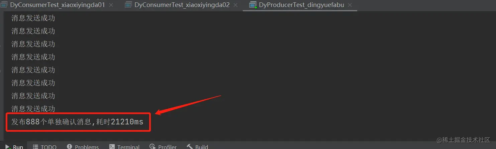
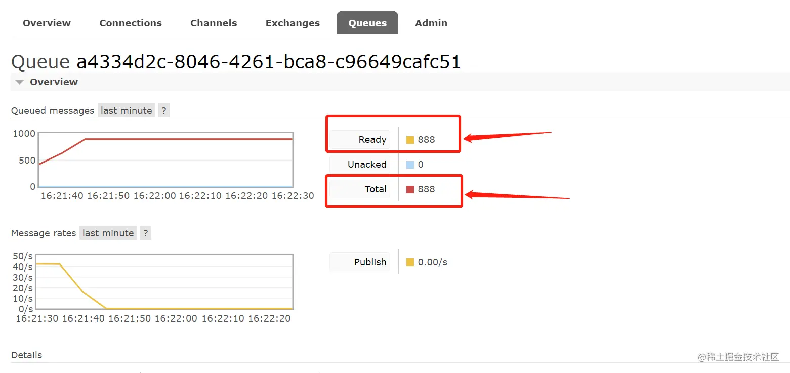
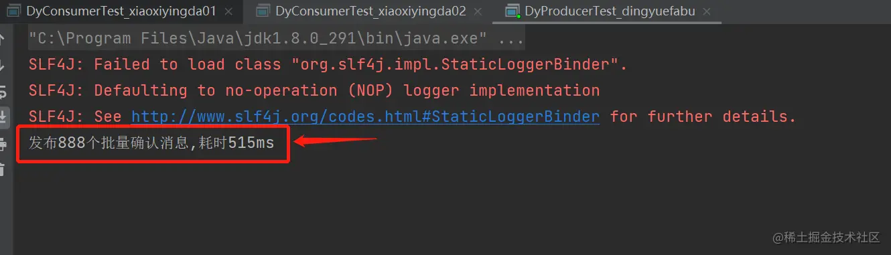
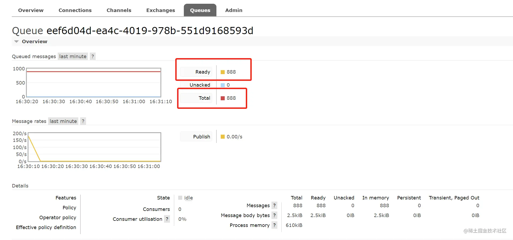
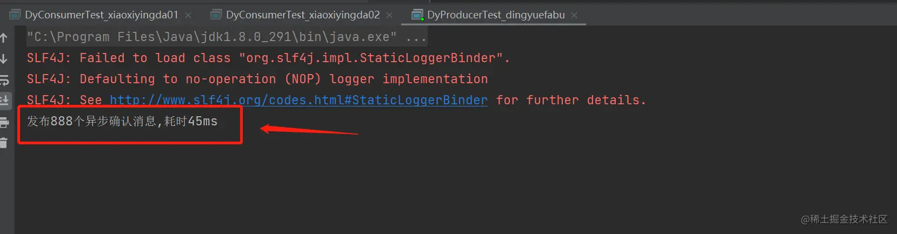
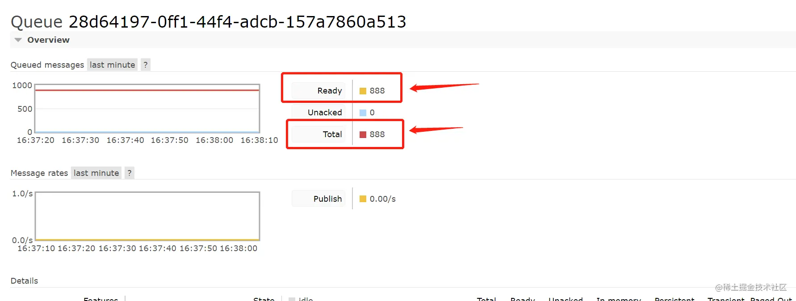

### 前言

- 生产者将信道设置成 confirm 模式，一旦信道进入 confirm 模式，所有在该信道上面发布的消息都将会被指派一个唯一的 ID(从 1 开始)，一旦消息被投递到所有匹配的队列之后。

- broker 就会发送一个确认给生产者(包含消息的唯一 ID)，这就使得生产者知道消息已经正确到达目的队列了，如果消息和队列是可持久化的，那么确认消息会在将消息写入磁盘之后发出。

- broker 回传 给生产者的确认消息中 delivery-tag 域包含了确认消息的序列号，此外 broker 也可以设置 basic.ack 的 multiple 域，表示到这个序列号之前的所有消息都已经得到了处理。

- confirm 模式最大的好处在于他是异步的，一旦发布一条消息，生产者应用程序就可以在等信 道返回确认的同时继续发送下一条消息，当消息最终得到确认之后。

- 生产者应用便可以通过回调方法来处理该确认消息，如果 RabbitMQ 因为自身内部错误导致消息丢失，就会发送一条 nack 消息，生产者应用程序同样可以在回调方法中处理该 nack 消息。

- 开启发布确认方式

  - 发布确认默认是没有开启的，如果要开启需要调用方法 confirmSelect，每当你要想使用发布 确认，都需要在 channel 上调用该方法

  - ```java
    //开启发布确认
    channel.confirmSelect();
    ```

### 一、单个确认发布

> 就是生产者发送一次消息就判断是否成功**发布消息**(channel.waitForConfirms())

- 这是一种简单的确认方式，它是一种同步确认发布的方式，也就是发布一个消息之后只有它 被确认发布，后续的消息才能继续发布,waitForConfirmsOrDie(long)这个方法只有在消息被确认 的时候才返回，如果在指定时间范围内这个消息没有被确认那么它将抛出异常。

- 生产者

  - ```java
    /**
     * 这是一个测试的生产者
     *@author DingYongJun
     *@date 2021/8/1
     */
    public class DyProducerTest_dingyuefabu {
    
        //设置执行次数
        public static final int MESSAGE_COUNT = 888;
        /**
         * 这里为了方便，我们使用main函数来测试
         * 纯属看你个人选择
         * @param args
         */
        public static void main(String[] args) throws Exception {
            //单个发布确认执行
            publishMessageIndividually();
        }
    
        /**
         * 单个发布确认
         */
        public static void publishMessageIndividually() throws Exception {
            Channel channel = RabbitMqUtils.getChannel();
            String queueName = UUID.randomUUID().toString();
            channel.queueDeclare(queueName, false, false, false, null);
            //开启发布确认
            channel.confirmSelect();
            long begin = System.currentTimeMillis();
            for (int i = 0; i < MESSAGE_COUNT; i++) {
                String message = i + "";
                channel.basicPublish("", queueName, null, message.getBytes());
                //服务端返回 false 或超时时间内未返回，生产者可以消息重发
                boolean flag = channel.waitForConfirms();
                if(flag){
                    System.out.println("消息发送成功");
                }
            }
            long end = System.currentTimeMillis();
            System.out.println("发布" + MESSAGE_COUNT + "个单独确认消息,耗时" + (end - begin) +
                    "ms");
        }
    }
    ```

- 执行结果

  - 
  - 

- 这种确认方式有一个最大的缺点就是:发布速度特别的慢，因为如果没有确认发布的消息就会 阻塞所有后续消息的发布，这种方式最多提供每秒不超过数百条发布消息的吞吐量。当然对于某 些应用程序来说这可能已经足够了。

- 当然，现在跟你说慢，你莫得感知，下面几种综合起来对比你就会发现他的效率有多低了！

### 二、批量确认发布

> 生产者所有消息发送完后，再判断是否成功发布(channel.waitForConfirms())。

- 与单个等待确认消息相比，先发布一批消息然后一起确认可以极大地 提高吞吐量。

- 生产者

  - ```java
    /**
    * 批量发布确认
    */
    public static void publishMessageBatch() throws Exception {
            Channel channel = RabbitMqUtils.getChannel();
            //队列名使用uuid来获取不重复的值，不需要自己再进行命名了。
            String queueName = UUID.randomUUID().toString();
            channel.queueDeclare(queueName, false, false, false, null);
            //开启发布确认
            channel.confirmSelect();
            //批量确认消息大小
            int batchSize = 88;
            //未确认消息个数
            int outstandingMessageCount = 0;
            long begin = System.currentTimeMillis();
            for (int i = 0; i < MESSAGE_COUNT; i++) {
                String message = i + "";
                channel.basicPublish("", queueName, null, message.getBytes());
                outstandingMessageCount++;
                if (outstandingMessageCount == batchSize) {
                    channel.waitForConfirms();//确认代码
                    outstandingMessageCount = 0;
                }
    
            }
            //为了确保还有剩余没有确认消息 再次确认
            if (outstandingMessageCount > 0) {
                channel.waitForConfirms();
            }
            long end = System.currentTimeMillis();
            System.out.println("发布" + MESSAGE_COUNT + "个批量确认消息,耗时" + (end - begin) +
                    "ms");
        }
    ```

- 执行结果

  - 
  - 

- 缺点：当发生故障导致发布出现问题时，不知道是哪个消息出现问题了，我们必须将整个批处理保存在内存中，以记录重要的信息而后重新发布消息。

- 当然这种方案仍然是同步的，也一样阻塞消息的发布。

### 三、异步确认发布

- 异步确认虽然编程逻辑比上两个要复杂，但是性价比最高，无论是可靠性还是效率都没得说， 他是利用回调函数来达到消息可靠性传递的，这个中间件也是通过函数回调来保证是否投递成功， 下面就让我们来详细讲解异步确认是怎么实现的。

- 生产者

  - ```java
        /**
         * 异步发布确认
         */
        public static void publishMessageAsync() throws Exception {
            try (Channel channel = RabbitMqUtils.getChannel()) {
                String queueName = UUID.randomUUID().toString();
                channel.queueDeclare(queueName, false, false, false, null);
                //开启发布确认
                channel.confirmSelect();
                /**
                 * 线程安全有序的一个哈希表，适用于高并发的情况
                 * 1.轻松的将序号与消息进行关联
                 * 2.轻松批量删除条目 只要给到序列号
                 * 3.支持并发访问
                 */
                ConcurrentSkipListMap<Long, String> outstandingConfirms = new
                        ConcurrentSkipListMap<>();
                /**
                 * 确认收到消息的一个回调
                 * 1.消息序列号
                 * 2.true 可以确认小于等于当前序列号的消息
                 * false 确认当前序列号消息
                 */
                ConfirmCallback ackCallback = (sequenceNumber, multiple) -> {
                    if (multiple) {
                        //返回的是小于等于当前序列号的未确认消息 是一个 map
                        ConcurrentNavigableMap<Long, String> confirmed =
                                outstandingConfirms.headMap(sequenceNumber, true);
                        //清除该部分未确认消息
                        confirmed.clear();
                    }else{
                        //只清除当前序列号的消息
                        outstandingConfirms.remove(sequenceNumber);
                    }
                };
                ConfirmCallback nackCallback = (sequenceNumber, multiple) -> {
                    String message = outstandingConfirms.get(sequenceNumber);
                    System.out.println("发布的消息"+message+"未被确认，序列号"+sequenceNumber);
                };
                /**
                 * 添加一个异步确认的监听器
                 * 1.确认收到消息的回调
                 * 2.未收到消息的回调
                 */
                channel.addConfirmListener(ackCallback, null);
                long begin = System.currentTimeMillis();
                for (int i = 0; i < MESSAGE_COUNT; i++) {
                    String message = "消息" + i;
                    /**
                     * channel.getNextPublishSeqNo()获取下一个消息的序列号
                     * 通过序列号与消息体进行一个关联
                     * 全部都是未确认的消息体
                     */
                    outstandingConfirms.put(channel.getNextPublishSeqNo(), message);
                    channel.basicPublish("", queueName, null, message.getBytes());
                }
                long end = System.currentTimeMillis();
                System.out.println("发布" + MESSAGE_COUNT + "个异步确认消息,耗时" + (end - begin) +
                        "ms");
            }
        }
    ```

- 执行结果

  - 
  - 

- 很容易看出，这种方式速度快的飞起呀！

- 如何处理未确认的消息？

  - 最好的解决的解决方案就是把未确认的消息放到一个基于内存的能被发布线程访问的队列， 比如说用 ConcurrentLinkedQueue 这个队列在 confirm callbacks 与发布线程之间进行消息的传递。

由于这个异步确认发布有点复杂，所以我把上面的代码解释了一下：

>**首先，这三个确认机制是发布者的**，自动应答和手动应答才是消费者的
>
>这段代码是使用 RabbitMQ 实现异步消息确认的例子。下面我来逐行解释每个步骤的含义：
>
>1. 创建一个 `Channel` 对象，使用完毕后会自动关闭。
>
>   ```java
>   try (Channel channel = RabbitMqUtils.getChannel()) {
>       // ...
>   }
>   ```
>
>2. 生成一个随机的队列名称，并在 RabbitMQ 中声明该队列。
>
>   ```java
>   String queueName = UUID.randomUUID().toString();
>   channel.queueDeclare(queueName, false, false, false, null);
>   ```
>
>3. 开启发布确认模式。
>
>   ```java
>   channel.confirmSelect();
>   ```
>
>4. 创建一个线程安全并且有序的哈希表 `outstandingConfirms`，用来存储未确认的消息。
>
>   ```java
>   ConcurrentSkipListMap<Long, String> outstandingConfirms = new ConcurrentSkipListMap<>();
>   ```
>
>5. 定义一个确认消息回调 `ackCallback`，用于处理已确认收到的消息。
>
>   ```java
>   ConfirmCallback ackCallback = (sequenceNumber, multiple) -> {
>       if (multiple) {
>           ConcurrentNavigableMap<Long, String> confirmed = outstandingConfirms.headMap(sequenceNumber, true);//这个true表示返回的子映射将包括键等于给定键的键值对。如果参数为 false，则返回的子映射将不包括键等于给定键的键值对，只包括小于给定键的键值对。
>           confirmed.clear(); // 因为是true(包含等于)，所以清除小于等于当前序列号的未确认消息
>       } else {
>           outstandingConfirms.remove(sequenceNumber); // 清除当前序列号的消息
>       }
>   };
>   ```
>
>6. 定义一个未确认消息回调 `nackCallback`，用于处理未确认的消息。
>
>   ```java
>   ConfirmCallback nackCallback = (sequenceNumber, multiple) -> {
>       //通过消息序列号，获取消息
>       String message = outstandingConfirms.get(sequenceNumber);
>       System.out.println("发布的消息" + message + "未被确认，序列号" + sequenceNumber);
>   };
>   ```
>
>7. 添加确认监听器，用于监听确认和未确认的消息。
>
>   ```java
>   channel.addConfirmListener(ackCallback, nackCallback);
>   ```
>
>8. 循环发送消息，在发送消息之前将消息序列号与消息内容关联，并存储到 `outstandingConfirms` 中。然后通过 `basicPublish` 方法将消息发送到指定队列中。
>
>   ```java
>   for (int i = 0; i < MESSAGE_COUNT; i++) {
>       String message = "消息" + i;
>       //channel.getNextPublishSeqNo()方法在未发布消息之前返回的是当前要发布消息的序列号。
>       outstandingConfirms.put(channel.getNextPublishSeqNo(), message); // 关联序列号和消息内容
>       channel.basicPublish("", queueName, null, message.getBytes());
>   }
>   ```
>
>9. 测量发送消息的耗时，并打印结果。
>
>   ```java
>   long end = System.currentTimeMillis();
>   System.out.println("发布" + MESSAGE_COUNT + "个异步确认消息,耗时" + (end - begin) +
>                       "ms");
>   ```
>
>

### 四、总结

- 单独发布消息
  - 耗时：21210ms
  - 同步等待确认，简单，但吞吐量非常有限。
- 批量发布消息
  - 耗时：525ms
  - 批量同步等待确认，简单，合理的吞吐量，一旦出现问题但很难推断出是那条 消息出现了问题。
- 异步处理
  - 耗时：45ms
  - 最佳性能和资源使用，在出现错误的情况下可以很好地控制，但是实现起来稍微难些