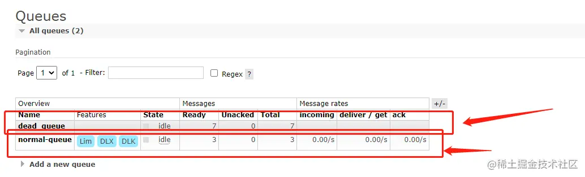

### 前言

- 讲到这里，MQ的基础也讲的差不多了，这是基础文章的最后一篇了！下面就会整合SpringBoot来进行实战讲解了！
- 死信队列，顾名思义就是无法被消费的消息。
- 有哪些原因会导致消息无法被消费呢？
  - 消息TTL过期。
  - 队列超长，就是队列满了，新的消息无法再加入到MQ队列中。
  - 消息被拒绝，即 basic.reject或者basic.nack，并且拒绝放回原队列（requeue=false）。
- 应用场景
  - 为了保证订单业务的消息数据不丢失，需要使用到 RabbitMQ 的死信队列机制，当消息消费发生异常时，将消息投入死信队列中。
  - 用户在商城下单成功并点击去支付后在指定时间未支付时自动失效。
  - 买火车票，半小时未付款即订单失效。
- 逻辑架构图
  - 

### 一、死信队列

#### ①、消息TTL过期

- 生产者

- ```java
  java复制代码/**
   * 这是一个测试的生产者
   *@author DingYongJun
   *@date 2021/8/6
   */
  public class DyProducerTest_dead {
  
      private static final String EXCHANGE_NAME = "normal_exchange";
      /**
       * 这里为了方便，我们使用main函数来测试
       * 纯属看你个人选择
       * @param args
       */
      public static void main(String[] args) throws Exception {
          publishMessageIndividually();
      }
  
      public static void publishMessageIndividually() throws Exception {
          //使用工具类来创建通道
          Channel channel = RabbitMqUtils.getChannel();
          channel.exchangeDeclare(EXCHANGE_NAME, BuiltinExchangeType.DIRECT);
          //设置过期时间，单位为ms
          AMQP.BasicProperties properties = new AMQP.BasicProperties().builder().expiration("10000").build();
          for (int i=0;i<5;i++){
              String msg = i+"消息";
              //发送消息到指定交换机中
              channel.basicPublish(EXCHANGE_NAME,"zhangsan",properties,msg.getBytes());
              System.out.println("我是生产者，我发送了+"+msg);
          }
      }
  }
  ```

- 消费者

- ```java
  java复制代码/**
   * 这是一个测试的消费者
   *
   * @author DingYongJun
   * @date 2021/8/6
   */
  public class DyConsumerTest_dead01 {
  
      //普通交换机
      private static final String EXCHANGE_NAME = "normal_exchange";
      //死信交换机，专门消费私信队列里面的消息
      private static final String DEAD_NAME = "dead_exchange";
  
      public static void main(String[] args) throws Exception {
          Channel channel = RabbitMqUtils.getChannel();
          //先申明两个交换机
          channel.exchangeDeclare(EXCHANGE_NAME, BuiltinExchangeType.DIRECT);//普通
          channel.exchangeDeclare(DEAD_NAME, BuiltinExchangeType.DIRECT);//死信
          //申明死信队列
          String deadQueueName = "dead_queue";
          channel.queueDeclare(deadQueueName,false,false,false,null);
          //将死信队列绑定到交换机上
          channel.queueBind(deadQueueName,DEAD_NAME,"lisi");
          //正常队列绑定死信队列信息
          Map<String, Object> params = new HashMap<>();
          //正常队列设置死信交换机 参数 key 是固定值
          params.put("x-dead-letter-exchange", DEAD_NAME);
          //正常队列设置死信 routing-key 参数 key 是固定值
          params.put("x-dead-letter-routing-key", "lisi");
  
          String normalQueue = "normal-queue";
          channel.queueDeclare(normalQueue, false, false, false, params);
          channel.queueBind(normalQueue, EXCHANGE_NAME, "zhangsan");
          System.out.println("等待接收消息.....");
          DeliverCallback deliverCallback = (consumerTag, delivery) -> {
              String message = new String(delivery.getBody(), "UTF-8");
              System.out.println("Consumer01 接收到消息"+message);
          };
          channel.basicConsume(normalQueue, true, deliverCallback, consumerTag -> {
          });
      }
  }
  ```

- 先启动消费者，然后停止，不然消息直接消费掉了，为了模拟让消息能够十秒后过期

- 查看后台页面，可以看到，普通队列和死信队列都启动成功了

- 

- 此时启动生产者，发送5条消息

- 

- 可以看到，普通队列中成功接受了5条消息。

- 

- 等待10秒钟，因为我们关闭了消费者，所以消息会过期，可以看到5条消息全部进入了死信队列中。

- 为什么死信中是10条？因为我先前已经测试了一遍，原先就有5条消息了。

- 

- 这时候我们写专门消费私信队列的消费者

- ```java
  java复制代码/**
   * 这是一个测试的消费者
   *@author DingYongJun
   *@date 2021/8/1
   */
  public class DyConsumerTest_dead02 {
      private static final String DEAD_EXCHANGE = "dead_exchange";
      public static void main(String[] argv) throws Exception {
          Channel channel = RabbitMqUtils.getChannel();
          channel.exchangeDeclare(DEAD_EXCHANGE, BuiltinExchangeType.DIRECT);
          String deadQueue = "dead_queue";
          channel.queueDeclare(deadQueue, false, false, false, null);
          channel.queueBind(deadQueue, DEAD_EXCHANGE, "lisi");
          System.out.println("等待接收死信队列消息.....");
          DeliverCallback deliverCallback = (consumerTag, delivery) -> {
              String message = new String(delivery.getBody(), "UTF-8");
              System.out.println("Consumer02 接收死信队列的消息" + message);
          };
          channel.basicConsume(deadQueue, true, deliverCallback, consumerTag -> {
          });
      }
  }
  ```

- 启动该消费者看结果

- 

- 

- 可以看到，成功被消费掉。

#### ②、队列超长

- 生产者注释掉过期时间参数
- 
- 正常消费者，增加队列长度的限制为3
- 
- 注意这时候要把原先的队列删除，因为参数发生了改变，不删除启动会报错。
- 
- 启动普通队列消费者和生产者
- 
- 正常队列只保存了3条信息，而死信队列有7条。证明超过了队列的容量也会进入死信队列。

#### ③、消息被拒

- 生产者代码不变

- 消费者模拟接受消息拒绝

- ```java
  java复制代码/**
   * 这是一个测试的消费者
   *
   * @author DingYongJun
   * @date 2021/8/6
   */
  public class DyConsumerTest_dead01 {
  
      //普通交换机
      private static final String EXCHANGE_NAME = "normal_exchange";
      //死信交换机，专门消费私信队列里面的消息
      private static final String DEAD_NAME = "dead_exchange";
  
      public static void main(String[] args) throws Exception {
          Channel channel = RabbitMqUtils.getChannel();
          //先申明两个交换机
          channel.exchangeDeclare(EXCHANGE_NAME, BuiltinExchangeType.DIRECT);//普通
          channel.exchangeDeclare(DEAD_NAME, BuiltinExchangeType.DIRECT);//死信
  
          //申明死信队列
          String deadQueueName = "dead_queue";
          channel.queueDeclare(deadQueueName,false,false,false,null);
          //将死信队列绑定到交换机上
          channel.queueBind(deadQueueName,DEAD_NAME,"lisi");
  
          //正常队列绑定死信队列信息
          Map<String, Object> params = new HashMap<>();
          //正常队列设置死信交换机 参数 key 是固定值
          params.put("x-dead-letter-exchange", DEAD_NAME);
          //正常队列设置死信 routing-key 参数 key 是固定值
          params.put("x-dead-letter-routing-key", "lisi");
          //设置队列的长度限制为3
  //        params.put("x-max-length",3);
  
          String normalQueue = "normal-queue";
          channel.queueDeclare(normalQueue, false, false, false, params);
          channel.queueBind(normalQueue, EXCHANGE_NAME, "zhangsan");
          System.out.println("等待接收消息.....");
          DeliverCallback deliverCallback = (consumerTag, delivery) -> {
              String message = new String(delivery.getBody(), "UTF-8");
              if (message.equals("3消息")){
                  System.out.println("收到这个消息但是我不想要："+message);
                  //requeue设置为false，表明拒绝重新入队，如果该队列配置了死信队列，拒绝后交换机会将其发送的死信队列当中。设置true的话，会自动重新入列。
                  channel.basicReject(delivery.getEnvelope().getDeliveryTag(),false);
              }else {
                  //其他消息正常应答
                  System.out.println("Consumer01 接收到消息"+message);
                  channel.basicAck(delivery.getEnvelope().getDeliveryTag(), false);
              }
          };
          channel.basicConsume(normalQueue, true, deliverCallback, consumerTag -> {
          });
      }
  }
  ```

- 执行生产者后

- 

- 启动消费者后

- 

#### 死信队列SpringBoot整合

* **生产者配置文件**

```java
@Configuration
public class MQConfig {

    public static String Exchange_direct = "Exchange_direct";
    public static String Exchange_dead = "Exchange_dead";
    public static String Queue01 = "Queue01";
    public static String Queue02 = "Queue02";
    public static String Queue_dead = "Queue_dead";

    //声明交换机
    @Bean("Exchange_direct")
    public Exchange exchange01(){
        return ExchangeBuilder.directExchange(Exchange_direct).durable(false).autoDelete().build();
    }

    @Bean("Exchange_dead")
    public Exchange exchange02(){
        return ExchangeBuilder.directExchange(Exchange_dead).durable(false).autoDelete().build();
    }

    //声明队列并绑定死信交换机
    @Bean("Queue01")
    public Queue queue01(){
        Map<String, Object> args = new HashMap<>();
        //声明当前队列绑定的死信交换机
        args.put("x-dead-letter-exchange", Exchange_dead);
        //声明当前队列的死信路由 key
        args.put("x-dead-letter-routing-key", "YD");
        //声明队列的 TTL
        args.put("x-message-ttl", 5000);

        return QueueBuilder.durable(Queue01).withArguments(args).build();
    }

    @Bean("Queue02")
    public Queue queue02(){
        Map<String, Object> args = new HashMap<>();
        //声明当前队列绑定的死信交换机
        args.put("x-dead-letter-exchange", Exchange_dead);
        //声明当前队列的死信路由 key
        args.put("x-dead-letter-routing-key", "YD");
        //声明队列的 TTL
        args.put("x-message-ttl", 10000);
        return QueueBuilder.durable(Queue02).withArguments(args).build();
    }

    @Bean("Queue_dead")
    public Queue queue(){
        return QueueBuilder.durable(Queue_dead).build();
    }

    //绑定
    @Bean
    public Binding binding01(@Qualifier("Exchange_direct") Exchange exchange,
                             @Qualifier("Queue01") Queue queue){
        return BindingBuilder.bind(queue).to(exchange).with("info01").noargs();
    }

    @Bean
    public Binding binding02(@Qualifier("Exchange_direct") Exchange exchange,
                             @Qualifier("Queue02") Queue queue){
        return BindingBuilder.bind(queue).to(exchange).with("info02").noargs();
    }

    @Bean
    public Binding binding_dead(@Qualifier("Exchange_dead") Exchange exchange,
                             @Qualifier("Queue_dead") Queue queue){
        return BindingBuilder.bind(queue).to(exchange).with("YD").noargs();
    }
}
```

* **生产者发送信息**

```java
    @Test
    void contextLoads() throws IOException, TimeoutException {
        String message = "hello啊";
        System.out.println("当前时间："+ new Date().toString()+",收到死信队列信息{}"+ message);
        rabbitTemplate.convertAndSend(MQConfig.Exchange_direct, "info02", "消息来自 ttl 为 10S 的队列: " + message);
        rabbitTemplate.convertAndSend(MQConfig.Exchange_direct,"info01","消息来自 ttl 为 5S 的队列: " + message);
    }
```

* **消费者监听代码**

> 只需要监听死信队列就行了，否则会被其他队列消费掉。

```java
@Configuration
public class MQListener {

    @RabbitListener(queues = "Queue_dead")
    public void listener(String message){
        System.out.println("我是死信队列= " + message);
        System.out.println("当前时间："+ new Date().toString()+",收到死信队列信息{}"+ message);
    }
}
```

**结果：**


### 二、延迟队列

- 延时队列,队列内部是有序的，最重要的特性就体现在它的延时属性上，延时队列中的元素是希望在指定时间到了以后或之前取出和处理。
- 简单来说，延时队列就是用来存放需要在指定时间被处理的元素的队列。
- 使用场景
  - 订单在十分钟之内未支付则自动取消
  - 预定会议后，需要在预定的时间点前十分钟通知各个与会人员参加会议
- 这些场景都有一个特点，需要在某个事件发生之后或者之前的指定时间点完成某一项任务
- 设置TTL
- 方式一
  - 对每条消息设置过期时间。
  - 对队列设置过期时间。
- 这里就不用代码演示了，后面的整合SpringBoot的实战文章会讲解！
- 大概讲解下思路
  - 我们有一个正常队。
  - 一个私信队列。
  - 对正常队列中的消息设置过期时间。
  - 如果到期之后该消息进入死信队列。
  - 然后有专门的消费者消费私信的队列的消息。
  - 这样是不是就相当于延迟队列？
- 至于为什么在这里不讲，因为这玩意是队列，先进先出，不用MQ插件来实现的话，看不出来效果，留在实战文章对比着详细解释吧


##### 在上面的死信队列基础上加些东西：

插件别忘记了先加好

* **一个配置文件：**

```java
@Configuration
public class RabbitMqConfig {

    public static final String DELAYED_QUEUE_NAME = "delayed.queue";
    public static final String DELAYED_EXCHANGE_NAME = "delayed.exchange";
    public static final String DELAYED_ROUTING_KEY = "delayed.routingkey";

    @Bean("delayed.exchange")
    public Exchange exchange(){
        Map<String, Object> stringObjectMap = new HashMap<>();
        stringObjectMap.put("x-delayed-type", "direct");
        return new CustomExchange(DELAYED_EXCHANGE_NAME,"x-delayed-message",true,false,stringObjectMap);
    }
    @Bean("delayed.queue")
    public Queue queue(){
        return QueueBuilder.durable(DELAYED_QUEUE_NAME).build();
    }

    @Bean
    public Binding binding(@Qualifier("delayed.exchange") Exchange exchange,
                           @Qualifier("delayed.queue")Queue queue){

        return BindingBuilder.bind(queue).to(exchange).with(DELAYED_ROUTING_KEY).noargs();
    }
}
```

* 一个发送消息的代码段

```java
rabbitTemplate.convertAndSend(RabbitMqConfig.DELAYED_EXCHANGE_NAME, RabbitMqConfig.DELAYED_ROUTING_KEY, message,
                correlationData -> {
            //设置延迟发送时间的，5000ms
                    correlationData.getMessageProperties().setDelay(5000);
                    return correlationData;
                });
```

* 延迟队列的监听器

```java
    @RabbitListener(queues = "delayed.queue")
    public void listener02(String message){
        System.out.println("我是延迟队列delayed.queue = " + message);
        System.out.println("当前时间："+ new Date().toString()+",收到延迟队列信息{}"+ message);
    }
```

运行结果：


over！！正好5秒！