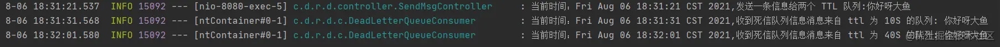

### 前言

- 新建SpringBoot项目，具体方法参考文章 [创建一个SpringBoot项目的两种方式](https://juejin.cn/post/6966026832453828615)
- 目录结构如下
  - 
- 代码架构图
- 
- 创建两个队列 QA 和 QB，两者队列 TTL 分别设置为 10S 和 40S。
- 然后在创建一个交换机 X 和死信交换机 Y，它们的类型都是 direct。
- 创建一个死信队列 QD。

### 一、延迟队列

- pom引入jar

  - ```java
    java复制代码	<!--RabbitMQ 依赖-->
           <dependency>
               <groupId>org.springframework.boot</groupId>
               <artifactId>spring-boot-starter-amqp</artifactId>
           </dependency>
           <dependency>
               <groupId>org.springframework.boot</groupId>
               <artifactId>spring-boot-starter-web</artifactId>
           </dependency>
           <dependency>
               <groupId>com.alibaba</groupId>
               <artifactId>fastjson</artifactId>
               <version>1.2.47</version>
           </dependency>
           <dependency>
               <groupId>org.projectlombok</groupId>
               <artifactId>lombok</artifactId>
           </dependency>
           <!--swagger-->
           <dependency>
               <groupId>io.springfox</groupId>
               <artifactId>springfox-swagger2</artifactId>
               <version>2.9.2</version>
           </dependency>
           <dependency>
               <groupId>io.springfox</groupId>
               <artifactId>springfox-swagger-ui</artifactId>
               <version>2.9.2</version>
           </dependency>
           <!--RabbitMQ 测试依赖-->
           <dependency>
               <groupId>org.springframework.amqp</groupId>
               <artifactId>spring-rabbit-test</artifactId>
               <scope>test</scope>
           </dependency>
    ```

- 将application.proprties后缀改为`yml`

  - ```java
    java复制代码spring:
      rabbitmq:
        host: IP地址
        port: 5672
        username: admin
        password: 111111
    ```

- 添加Swagger config类

  - ```java
    java复制代码import org.springframework.context.annotation.Bean;
    import org.springframework.context.annotation.Configuration;
    import springfox.documentation.builders.ApiInfoBuilder;
    import springfox.documentation.service.ApiInfo;
    import springfox.documentation.service.Contact;
    import springfox.documentation.spi.DocumentationType;
    import springfox.documentation.spring.web.plugins.Docket;
    import springfox.documentation.swagger2.annotations.EnableSwagger2;
    
    /**
     * Swagger配置类
     * @author DingYongJun
     * @date 2021/8/6
     */
    @Configuration
    @EnableSwagger2
    public class SwaggerConfig {
        @Bean
        public Docket webApiConfig() {
            return new Docket(DocumentationType.SWAGGER_2)
                    .groupName("webApi")
                    .apiInfo(webApiInfo())
                    .select()
                    .build();
        }
    
        private ApiInfo webApiInfo() {
            return new ApiInfoBuilder()
                    .title("rabbitmq 接口文档")
                    .description("本文档描述了 rabbitmq 微服务接口定义")
                    .version("1.0")
                    .contact(new Contact("dayu", "https://juejin.cn/user/2084329779387864/posts",
                            "773530472@qq.com"))
                    .build();
        }
    }
    ```

- MQ config

  - ```java
    java复制代码import org.springframework.amqp.core.*;
    import org.springframework.beans.factory.annotation.Qualifier;
    import org.springframework.context.annotation.Bean;
    import org.springframework.context.annotation.Configuration;
    
    import java.util.HashMap;
    import java.util.Map;
    
    /**
     * MQ配置类
     * @author DingYongJun
     * @date 2021/8/6
     */
    @Configuration
    public class TtlQueueConfig {
        public static final String X_EXCHANGE = "X";
        public static final String QUEUE_A = "QA";
        public static final String QUEUE_B = "QB";
        public static final String Y_DEAD_LETTER_EXCHANGE = "Y";
        public static final String DEAD_LETTER_QUEUE = "QD";
    
        // 声明 xExchange
        @Bean("xExchange")
        public DirectExchange xExchange() {
            return new DirectExchange(X_EXCHANGE);
        }
    
        // 声明 xExchange
        @Bean("yExchange")
        public DirectExchange yExchange() {
            return new DirectExchange(Y_DEAD_LETTER_EXCHANGE);
        }
    
        //声明队列 A ttl 为 10s 并绑定到对应的死信交换机
        @Bean("queueA")
        public Queue queueA() {
            Map<String, Object> args = new HashMap<>(3);
            //声明当前队列绑定的死信交换机
            args.put("x-dead-letter-exchange", Y_DEAD_LETTER_EXCHANGE);
            //声明当前队列的死信路由 key
            args.put("x-dead-letter-routing-key", "YD");
            //声明队列的 TTL
            args.put("x-message-ttl", 10000);
            return QueueBuilder.durable(QUEUE_A).withArguments(args).build();
        }
    
        // 声明队列 A 绑定 X 交换机
        @Bean
        public Binding queueaBindingX(@Qualifier("queueA") Queue queueA,
                                      @Qualifier("xExchange") DirectExchange xExchange) {
            return BindingBuilder.bind(queueA).to(xExchange).with("XA");
        }
    
        //声明队列 B ttl 为 40s 并绑定到对应的死信交换机
        @Bean("queueB")
        public Queue queueB() {
            Map<String, Object> args = new HashMap<>(3);
            //声明当前队列绑定的死信交换机
            args.put("x-dead-letter-exchange", Y_DEAD_LETTER_EXCHANGE);
            //声明当前队列的死信路由 key
            args.put("x-dead-letter-routing-key", "YD");
            //声明队列的 TTL
            args.put("x-message-ttl", 40000);
            return QueueBuilder.durable(QUEUE_B).withArguments(args).build();
        }
    
        //声明队列 B 绑定 X 交换机
        @Bean
        public Binding queuebBindingX(@Qualifier("queueB") Queue queue1B,
                                      @Qualifier("xExchange") DirectExchange xExchange) {
            return BindingBuilder.bind(queue1B).to(xExchange).with("XB");
        }
    
        //声明死信队列 QD
        @Bean("queueD")
        public Queue queueD() {
            return new Queue(DEAD_LETTER_QUEUE);
        }
    
        //声明死信队列 QD 绑定关系
        @Bean
        public Binding deadLetterBindingQAD(@Qualifier("queueD") Queue queueD,
                                            @Qualifier("yExchange") DirectExchange yExchange) {
            return BindingBuilder.bind(queueD).to(yExchange).with("YD");
        }
    }
    ```

- controller模拟生产者

  - ```java
    java复制代码import lombok.extern.slf4j.Slf4j;
    import org.springframework.amqp.rabbit.core.RabbitTemplate;
    import org.springframework.beans.factory.annotation.Autowired;
    import org.springframework.web.bind.annotation.GetMapping;
    import org.springframework.web.bind.annotation.PathVariable;
    import org.springframework.web.bind.annotation.RequestMapping;
    import org.springframework.web.bind.annotation.RestController;
    
    import java.util.Date;
    
    /**
     * controller模拟生产者
     * @author DingYongJun
     * @date 2021/8/6
     */
    @Slf4j
    @RequestMapping("ttl")
    @RestController
    public class SendMsgController {
        @Autowired
        private RabbitTemplate rabbitTemplate;
    
        @GetMapping("sendMsg/{message}")
        public void sendMsg(@PathVariable String message) {
            log.info("当前时间：{},发送一条信息给两个 TTL 队列:{}", new Date(), message);
            rabbitTemplate.convertAndSend("X", "XA", "消息来自 ttl 为 10S 的队列: " + message);
            rabbitTemplate.convertAndSend("X", "XB", "消息来自 ttl 为 40S 的队列: " + message);
        }
    }
    ```

- 消费者

  - ```java
    java复制代码import com.rabbitmq.client.Channel;
    import lombok.extern.slf4j.Slf4j;
    import org.springframework.amqp.core.Message;
    import org.springframework.amqp.rabbit.annotation.RabbitListener;
    import org.springframework.stereotype.Component;
    
    import java.io.IOException;
    import java.util.Date;
    
    /**
     * 消费者
     * @author DingYongJun
     * @date 2021/8/6
     */
    @Slf4j
    @Component
    public class DeadLetterQueueConsumer {
        @RabbitListener(queues = "QD")
        public void receiveD(Message message, Channel channel) throws IOException {
            String msg = new String(message.getBody());
            log.info("当前时间：{},收到死信队列信息{}", new Date().toString(), msg);
        }
    }
    ```

- 咋样，整合了SpringBoot后，是不是简单了很多？

- 准备就绪，我们来启动项目，在浏览器中输入

  - ```java
    java
    复制代码http://localhost:8080/ttl/sendMsg/你好呀大鱼
    ```

- 执行结果

  - 
  - 算下时间，第一条时间间隔10s。
  - 第二条为40s。
  - 完美符合我们的设计预期！
  - 第一条消息在 10S 后变成了死信消息，然后被消费者消费掉，第二条消息在 40S 之后变成了死信消息，然后被消费掉，这样一个延时队列就打造完成了。

### 二、优化延迟队列

- 按照上面的设计，如果我们现在需要增加一个50秒延迟的消息，咋办？

- 难不成我们再在增加一个MQ config？这也太不智能了吧！

- 如果是预定会议室这种需求，岂不是需要增加无数个队列？

- 所以下面我们需要对上面这种结构进行优化！

- 代码架构图

  - 

- 新增MQ config

  - ```java
    java复制代码import org.springframework.amqp.core.*;
    import org.springframework.beans.factory.annotation.Qualifier;
    import org.springframework.context.annotation.Bean;
    import org.springframework.stereotype.Component;
    
    import java.util.HashMap;
    import java.util.Map;
    /**
     * 新的MQ配置类
     * @author DingYongJun
     * @date 2021/8/6
     */
    @Component
    public class MsgTtlQueueConfig {
        public static final String Y_DEAD_LETTER_EXCHANGE = "Y";
        public static final String QUEUE_C = "QC";
    
        //声明队列 C 死信交换机
        @Bean("queueC")
        public Queue queueB() {
            Map<String, Object> args = new HashMap<>(3);
            //声明当前队列绑定的死信交换机
            args.put("x-dead-letter-exchange", Y_DEAD_LETTER_EXCHANGE);
            //声明当前队列的死信路由 key
            args.put("x-dead-letter-routing-key", "YD");
            //没有声明 TTL 属性
            return QueueBuilder.durable(QUEUE_C).withArguments(args).build();
        }
    
        //声明队列 B 绑定 X 交换机
        @Bean
        public Binding queuecBindingX(@Qualifier("queueC") Queue queueC,
                                      @Qualifier("xExchange") DirectExchange xExchange) {
            return BindingBuilder.bind(queueC).to(xExchange).with("XC");
        }
    }
    ```

- controller

  - ```java
    java复制代码    @RequestMapping(value = "sendExpirationMsg", method = RequestMethod.GET)
        public void sendMsg(@RequestParam Map<String,Object> parmsMap) {
            String message = parmsMap.get("message").toString();
            String ttlTime = parmsMap.get("ttlTime").toString();
            rabbitTemplate.convertAndSend("X", "XC", message, correlationData ->{
                correlationData.getMessageProperties().setExpiration(ttlTime);
                return correlationData;
            });
            log.info("当前时间：{},发送一条时长{}毫秒 TTL 信息给队列 C:{}", new Date(),ttlTime, message);
        }
    ```

  - 这里我们使用Map来接受参数了，毕竟Map无敌好用呀~

- 浏览器输入

  - ```java
    java复制代码http://localhost:8080/ttl/sendExpirationMsg?message=你好呀大鱼先生&ttlTime=50000
    http://localhost:8080/ttl/sendExpirationMsg?message=你好呀大鱼先生&ttlTime=5000
    ```

- 执行结果

  - 
  - 完美达到要求！过期时间自定义化了！这才是智能呀！

### 三、MQ插件实现延迟队列

- 上面的功能看起来似乎没啥问题对吧？

- 但是我们要知道，MQ只会检查第一个消息是否过期，如果第一个消息延迟很长时间

- 会导致我们第二消息不回优先得到执行

- 因为队列是先进先出，没毛病吧？

- 眼见为实

- 

- 很明显看出

  - 我们想要的是第二个5秒延迟的先行消费，然后才是50秒延迟的那条消息。
  - 实际上MQ是等第一条执行完，才立马执行第二条。
  - 这就是先进先出的原因。

- MQ的插件帮我们解决了这个问题

- 首先下载插件 [rabbitmq_delayed_message_exchange](https://link.juejin.cn?target=https%3A%2F%2Fgithub.com%2Frabbitmq%2Frabbitmq-delayed-message-exchange%2Freleases%2Ftag%2F3.8.17)

- 一定要看好版本哦~否则会报版本错误。

- 然后上传到服务器中的 `/usr/lib/rabbitmq/lib/rabbitmq_server-3.7.18/plugins`目录下

- 执行 `rabbitmq-plugins enable rabbitmq_delayed_message_exchange` 安装

- 重启MQ `systemctl restart rabbitmq-server`

- 看下我们的MQ后台页面

- 

- 出现了`x-delayed-message`的交换机类型，恭喜你启用插件成功啦！

- MQ config

  - ```java
    java复制代码import org.springframework.amqp.core.Binding;
    import org.springframework.amqp.core.BindingBuilder;
    import org.springframework.amqp.core.CustomExchange;
    import org.springframework.amqp.core.Queue;
    import org.springframework.beans.factory.annotation.Qualifier;
    import org.springframework.context.annotation.Bean;
    import org.springframework.context.annotation.Configuration;
    
    import java.util.HashMap;
    import java.util.Map;
    
    @Configuration
    public class DelayedQueueConfig {
        public static final String DELAYED_QUEUE_NAME = "delayed.queue";
        public static final String DELAYED_EXCHANGE_NAME = "delayed.exchange";
        public static final String DELAYED_ROUTING_KEY = "delayed.routingkey";
    
        @Bean
        public Queue delayedQueue() {
            return new Queue(DELAYED_QUEUE_NAME);
        }
    
        //自定义交换机 我们在这里定义的是一个延迟交换机
        @Bean
        public CustomExchange delayedExchange() {
            Map<String, Object> args = new HashMap<>();
            //自定义交换机的类型
            args.put("x-delayed-type", "direct");
            return new CustomExchange(DELAYED_EXCHANGE_NAME, "x-delayed-message", true, false,
                    args);
        }
    
        @Bean
        public Binding bindingDelayedQueue(@Qualifier("delayedQueue") Queue queue,
                                           @Qualifier("delayedExchange") CustomExchange
                                                   delayedExchange) {
            return
                    BindingBuilder.bind(queue).to(delayedExchange).with(DELAYED_ROUTING_KEY).noargs();
        }
    }
    ```

- controller

  - ```java
    java复制代码    public static final String DELAYED_EXCHANGE_NAME = "delayed.exchange";
        public static final String DELAYED_ROUTING_KEY = "delayed.routingkey";
    
        @GetMapping("sendDelayMsg/{message}/{delayTime}")
        public void sendMsg(@PathVariable String message, @PathVariable Integer delayTime) {
            rabbitTemplate.convertAndSend(DELAYED_EXCHANGE_NAME, DELAYED_ROUTING_KEY, message,
                    correlationData -> {
                        correlationData.getMessageProperties().setDelay(delayTime);
                        return correlationData;
                    });
            log.info(" 当 前 时 间 ： {}, 发送一条延迟 {} 毫秒的信息给队列 delayed.queue:{}", new
                    Date(), delayTime, message);
        }
    ```

- 执行

  - ```java
    java复制代码http://localhost:8080/ttl/sendDelayMsg/come on baby1/20000
    http://localhost:8080/ttl/sendDelayMsg/come on baby2/2000
    ```

- 执行结果

  - 

- 解决！！！