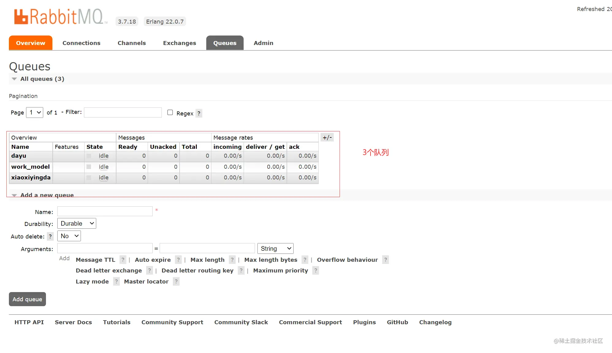
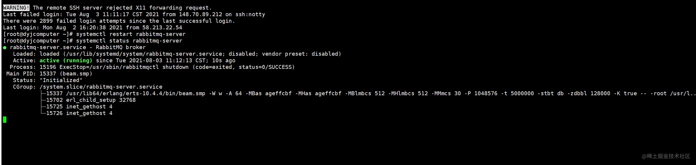
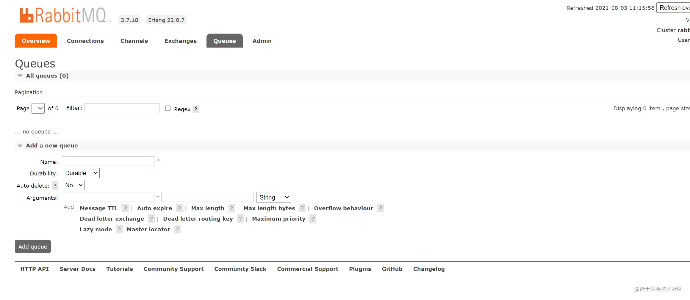
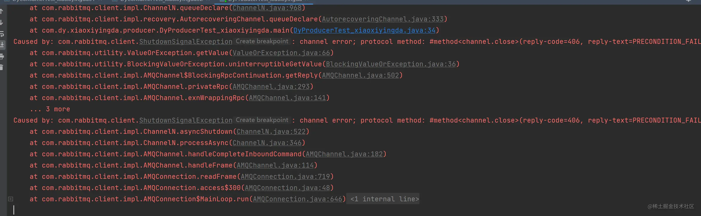
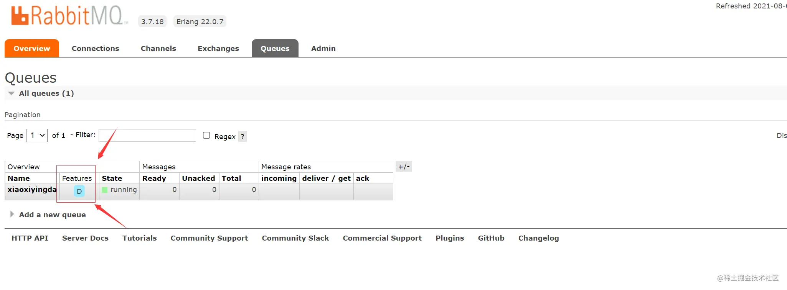

### 前言

- 刚刚我们已经看到了如何处理任务不丢失的情况，但是如何保障当 RabbitMQ 服务停掉以后消 息生产者发送过来的消息不丢失。
- 默认情况下 RabbitMQ 退出或由于某种原因崩溃时，它忽视队列 和消息，除非告知它不要这样做。
- 确保消息不会丢失需要做两件事：我们需要将队列和消息都标 记为持久化。

### 一、队列持久化

- 之前我们创建的队列都是非持久化的，rabbitmq 如果重启的化，该队列就会被删除掉，如果 要队列实现持久化 需要在声明队列的时候把 durable 参数设置为持久化

- 

- 我们重启一下RabbitMQ

- 

- 重启成功刷新下管理页面

- 

- 呀，我们的队列丢了~

- 很明显，在生产环境中，我们不可能保证服务器永不重启，永不断电。所以如果不对队列进行持久化的话，数据很容易丢失。

- 持久化数据是我们必须要做的事情。

- 但是需要注意的就是如果之前声明的队列不是持久化的，需要把原先队列先删除，或者重新 创建一个持久化的队列，不然就会出现错误

- 源码如下

- ```java
  java复制代码    public com.rabbitmq.client.impl.AMQImpl.Queue.DeclareOk queueDeclare(String queue, boolean durable, boolean exclusive, boolean autoDelete, Map<String, Object> arguments) throws IOException {
          validateQueueNameLength(queue);
          return (com.rabbitmq.client.impl.AMQImpl.Queue.DeclareOk)this.exnWrappingRpc((new com.rabbitmq.client.AMQP.Queue.Declare.Builder()).queue(queue).durable(durable).exclusive(exclusive).autoDelete(autoDelete).arguments(arguments).build()).getMethod();
      }
  ```

- 更改生产者代码

- ```java
  java复制代码/**
   * 这是一个测试的生产者
   *@author DingYongJun
   *@date 2021/8/1
   */
  public class DyProducerTest_xiaoxiyingda {
      /**
       * 这里为了方便，我们使用main函数来测试
       * 纯属看你个人选择
       * @param args
       */
      public static void main(String[] args) throws Exception{
          //使用工具类来创建通道
          Channel channel = RabbitMqUtils.getChannel();
  
          /**
           * 生成一个队列
           * 1.队列名称
           * 2.队列里面的消息是否持久化 默认消息存储在内存中
           * 3.该队列是否只供一个消费者进行消费 是否进行共享 true 可以多个消费者消费
           * 4.是否自动删除 最后一个消费者端开连接以后 该队列是否自动删除 true 自动删除
           * 5.其他参数
           */
          //这是持久化的参数。false不进行持久化，true进行持久化
          boolean durable = true;
          channel.queueDeclare(QueueNameConstant.XIAOXIYINGDA_MODEL,durable,false,false,null);
  
          /**
           * 发送一个消息
           * 1.发送到那个交换机
           * 2.路由的 key 是哪个
           * 3.其他的参数信息
           * 4.发送消息的消息体
           */
          Scanner sc = new Scanner(System.in);
          System.out.println("请输入信息");
          while (sc.hasNext()) {
              String message = sc.nextLine();
              channel.basicPublish("",QueueNameConstant.XIAOXIYINGDA_MODEL,null,message.getBytes());
              System.out.println("生产者发出消息" + message);
          }
      }
  }
  ```

- 上面说过了，必须删除原有队列，否则会报错。

- 

- 详细报错信息

  - ```java
    java
    复制代码Caused by: com.rabbitmq.client.ShutdownSignalException: channel error; protocol method: #method<channel.close>(reply-code=406, reply-text=PRECONDITION_FAILED - inequivalent arg 'durable' for queue 'xiaoxiyingda' in vhost '/': received 'true' but current is 'false', class-id=50, method-id=10)
    ```

- 好了 删除原有队列，再次执行。

- 

- Features中出现这D字母，证明队列持久化成功啦！

- 再次重启RabbitMQ试试看。节省篇幅，不粘图片了。

- 

- 完美！队列还在！nice！

### 二、消息持久化

- 修改生产者代码

  - ```java
    java复制代码/**
     * 这是一个测试的生产者
     *@author DingYongJun
     *@date 2021/8/1
     */
    public class DyProducerTest_xiaoxiyingda {
        /**
         * 这里为了方便，我们使用main函数来测试
         * 纯属看你个人选择
         * @param args
         */
        public static void main(String[] args) throws Exception{
            //使用工具类来创建通道
            Channel channel = RabbitMqUtils.getChannel();
    
            /**
             * 生成一个队列
             * 1.队列名称
             * 2.队列里面的消息是否持久化 默认消息存储在内存中
             * 3.该队列是否只供一个消费者进行消费 是否进行共享 true 可以多个消费者消费
             * 4.是否自动删除 最后一个消费者端开连接以后 该队列是否自动删除 true 自动删除
             * 5.其他参数
             */
            //这是持久化的参数。false不进行持久化，true进行持久化
            boolean durable = true;
            channel.queueDeclare(QueueNameConstant.XIAOXIYINGDA_MODEL,durable,false,false,null);
    
            /**
             * 发送一个消息
             * 1.发送到那个交换机
             * 2.路由的 key 是哪个
             * 3.其他的参数信息
             * 4.发送消息的消息体
             */
            Scanner sc = new Scanner(System.in);
            System.out.println("请输入信息");
            while (sc.hasNext()) {
                String message = sc.nextLine();
                //MessageProperties.PERSISTENT_TEXT_PLAIN;这个代表消息持久化到硬盘
                channel.basicPublish("",QueueNameConstant.XIAOXIYINGDA_MODEL,MessageProperties.PERSISTENT_TEXT_PLAIN,message.getBytes());
                System.out.println("生产者发出消息" + message);
            }
        }
    
    }
    ```

  - MessageProperties.PERSISTENT_TEXT_PLAIN

    - 看下源码，这是啥东东？

    - ```java
      java复制代码    public void basicPublish(String exchange, String routingKey, BasicProperties props, byte[] body) throws IOException {
              this.basicPublish(exchange, routingKey, false, props, body);
          }
      ```

    - ```java
      public class MessageProperties {
          public static final BasicProperties MINIMAL_BASIC = new BasicProperties((String)null, (String)null, (Map)null, (Integer)null, (Integer)null, (String)null, (String)null, (String)null, (String)null, (Date)null, (String)null, (String)null, (String)null, (String)null);
          public static final BasicProperties MINIMAL_PERSISTENT_BASIC = new BasicProperties((String)null, (String)null, (Map)null, 2, (Integer)null, (String)null, (String)null, (String)null, (String)null, (Date)null, (String)null, (String)null, (String)null, (String)null);
          public static final BasicProperties BASIC = new BasicProperties("application/octet-stream", (String)null, (Map)null, 1, 0, (String)null, (String)null, (String)null, (String)null, (Date)null, (String)null, (String)null, (String)null, (String)null);
          public static final BasicProperties PERSISTENT_BASIC = new BasicProperties("application/octet-stream", (String)null, (Map)null, 2, 0, (String)null, (String)null, (String)null, (String)null, (Date)null, (String)null, (String)null, (String)null, (String)null);
          public static final BasicProperties TEXT_PLAIN = new BasicProperties("text/plain", (String)null, (Map)null, 1, 0, (String)null, (String)null, (String)null, (String)null, (Date)null, (String)null, (String)null, (String)null, (String)null);
          public static final BasicProperties PERSISTENT_TEXT_PLAIN = new BasicProperties("text/plain", (String)null, (Map)null, 2, 0, (String)null, (String)null, (String)null, (String)null, (Date)null, (String)null, (String)null, (String)null, (String)null);
      
          public MessageProperties() {
          }
      }
      ```

    - **通过设置 MessageProperties.PERSISTENT_TEXT_PLAIN 属性，发送的消息将被标记为持久化文本类型，并在 RabbitMQ 服务器上进行保存，以确保消息的可靠性。**