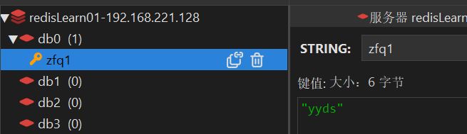

#### 第一步、添加redis依赖

```xml
        <dependency>
            <groupId>org.springframework.boot</groupId>
            <artifactId>spring-boot-starter-data-redis</artifactId>
        </dependency>
```


#### 第二步、添加yaml配置

```yaml
spring:
  data:
    redis:
      port: 6379
      password: 123456
      host: 192.168.221.128
      database: 0
```


#### 第三步、添加redis序列化的配置文件

> **注意：**这里不配置序列化的格式也可以，但是会在使用RedisTemplate的时候产生乱码；

```java
package com.example.redis_test01.conf;


import com.fasterxml.jackson.annotation.JsonAutoDetect;
import com.fasterxml.jackson.annotation.JsonTypeInfo;
import com.fasterxml.jackson.annotation.PropertyAccessor;
import com.fasterxml.jackson.databind.ObjectMapper;
import com.fasterxml.jackson.databind.jsontype.impl.LaissezFaireSubTypeValidator;
import org.springframework.boot.autoconfigure.condition.ConditionalOnMissingBean;
import org.springframework.context.annotation.Bean;
import org.springframework.context.annotation.Configuration;
import org.springframework.data.redis.connection.RedisConnectionFactory;
import org.springframework.data.redis.core.RedisTemplate;
import org.springframework.data.redis.core.StringRedisTemplate;
import org.springframework.data.redis.serializer.GenericJackson2JsonRedisSerializer;
import org.springframework.data.redis.serializer.Jackson2JsonRedisSerializer;
import org.springframework.data.redis.serializer.RedisSerializer;
import org.springframework.data.redis.serializer.StringRedisSerializer;

/**
 * Redis配置
 *
 * @author: jacklin
 * @date: 2022/9/9 0:07
 */
@Configuration
public class RedisConfig {

    //GenericJackson2JsonRedisSerializer
    @Bean
    @ConditionalOnMissingBean(name = "redisTemplate")
    public RedisTemplate<String, Object> redisTemplate(RedisConnectionFactory factory){
        RedisTemplate<String, Object> template = new RedisTemplate<>();
        template.setConnectionFactory(factory);

        //String的序列化方式
        StringRedisSerializer stringRedisSerializer = new StringRedisSerializer();
        // 使用GenericJackson2JsonRedisSerializer 替换默认序列化(默认采用的是JDK序列化)
        GenericJackson2JsonRedisSerializer genericJackson2JsonRedisSerializer = new GenericJackson2JsonRedisSerializer();

        //key序列化方式采用String类型
        template.setKeySerializer(stringRedisSerializer);
        //value序列化方式采用jackson类型
        template.setValueSerializer(genericJackson2JsonRedisSerializer);
        //hash的key序列化方式也是采用String类型
        template.setHashKeySerializer(stringRedisSerializer);
        //hash的value也是采用jackson类型
        template.setHashValueSerializer(genericJackson2JsonRedisSerializer);
        template.afterPropertiesSet();
        return template;
    }

    //Jackson2JsonRedisSerializer
    //@Bean
    //@ConditionalOnMissingBean(name = "redisTemplate")
    //public RedisTemplate<String, Object> redisTemplate(RedisConnectionFactory factory) {
    //    RedisTemplate<String, Object> template = new RedisTemplate<>();
    //    template.setConnectionFactory(factory);
    //
    //    //String的序列化方式
    //    StringRedisSerializer stringRedisSerializer = new StringRedisSerializer();
    //    //使用Jackson2JsonRedisSerialize 替换默认序列化(默认采用的是JDK序列化)
    //    Jackson2JsonRedisSerializer<Object> jackson2JsonRedisSerializer = new Jackson2JsonRedisSerializer<>(Object.class);
    //
    //    // 如果采用Jackson2JsonRedisSerializer序列化方式，没有ObjectMapper配置在强转对象的时候会反序列化失败，也就是User user = (User) redisTemplate.opsForValue().get(key) 会失败;
    //    ObjectMapper objectMapper = new ObjectMapper();
    //    objectMapper.setVisibility(PropertyAccessor.ALL, JsonAutoDetect.Visibility.ANY);
    //    objectMapper.activateDefaultTyping(LaissezFaireSubTypeValidator.instance, ObjectMapper.DefaultTyping.NON_FINAL, JsonTypeInfo.As.PROPERTY);
    //    jackson2JsonRedisSerializer.setObjectMapper(objectMapper);
    //
    //    //key序列化方式采用String类型
    //    template.setKeySerializer(stringRedisSerializer);
    //    //value序列化方式采用jackson类型
    //    template.setValueSerializer(jackson2JsonRedisSerializer);
    //    //hash的key序列化方式也是采用String类型
    //    template.setHashKeySerializer(stringRedisSerializer);
    //    //hash的value也是采用jackson类型
    //    template.setHashValueSerializer(jackson2JsonRedisSerializer);
    //    template.afterPropertiesSet();
    //    return template;
    //}

    ////FastJsonRedisSerializer
    //@Bean("redisTemplate")
    //public RedisTemplate<String, Object> redisTemplate(RedisConnectionFactory factory){
    //    RedisTemplate<String, Object> template = new RedisTemplate<>();
    //    template.setConnectionFactory(factory);
    //
    //    //String序列化方式
    //    StringRedisSerializer stringRedisSerializer = new StringRedisSerializer();
    //    // 使用FastJsonRedisSerializer替换默认序列化(默认采用的是JDK序列化)
    //    FastJsonRedisSerializer<Object> fastJsonRedisSerializer = new FastJsonRedisSerializer<>(Object.class);
    //
    //    //key序列化方式采用String类型
    //    template.setKeySerializer(stringRedisSerializer);
    //    //value序列化方式采用jackson类型
    //    template.setValueSerializer(fastJsonRedisSerializer);
    //    //hash的key序列化方式也是采用String类型
    //    template.setHashKeySerializer(stringRedisSerializer);
    //    //hash的value也是采用jackson类型
    //    template.setHashValueSerializer(fastJsonRedisSerializer);
    //    template.afterPropertiesSet();
    //    return template;
    //}

}
```

##### 对比这三个序列化格式 和 选择的策略：

> 这三种Redis序列化方式都是用于将Java对象序列化成JSON字符串，并存储到Redis缓存中。它们的主要区别如下：
>
> 1. GenericJackson2JsonRedisSerializer：这个序列化方式使用了Jackson库，能够很好地处理一些复杂场景（例如泛型参数、集合等）。相比于其他两种序列化方式，它的优点在于处理更加灵活和全面。但是它也有一个缺点：它序列化后的JSON字符串比较长，可能会导致存储效率不高。
> 2. Jackson2JsonRedisSerializer：同样使用了Jackson库，但与GenericJackson2JsonRedisSerializer不同的是，它只支持特定类型的Java对象转换为JSON字符串，比如POJO类。它可以通过指定Java类型来设置反序列化器。相对于其他两种方式，它的序列化结果要更加紧凑，存储效率更高，但是可能在处理某些数据结构时存在局限性。
> 3. FastJsonRedisSerializer：这个序列化方式则使用了阿里巴巴的FastJson库，所以它的处理速度很快。相比于 Jackson 库，FastJson 序列化后的JSON 字符串长度更短，存储空间更小，同时序列化性能也更高，但是由于 FastJson 序列化时默认添加配置信息，因此需要手动进行去除（否则存入 Redis 后取出的为非预期类），因此在使用时需要注意。

>  综上所述，选择哪种序列化方式应该根据具体情况而定。如果需要处理比较复杂的Java对象或者数据结构，那么 GenericJackson2JsonRedisSerializer 比较合适；如果需要存储简单的 POJO 类型，则可以考虑使用 Jackson2JsonRedisSerializer；如果注重性能和空间利用率，则可以选择 FastJsonRedisSerializer。


#### 第四步：测试

```java
@SpringBootTest
class RedisTest01ApplicationTests {
    @Resource
    RedisTemplate<String,Object> redisTemplate;

    @Test
    void contextLoads() {
        redisTemplate.opsForValue().set("zfq1","yyds");
    }

}
```

结果：必定无乱码

