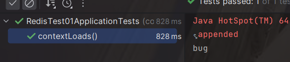

#### 一、引入Redisson依赖

##### **redisson-spring-data与Spring Boot version的版本对应关系**

| redisson-spring-data module name | Spring Boot version |
| -------------------------------- | ------------------- |
| redisson-spring-data-16          | 1.3.x               |
| redisson-spring-data-17          | 1.4.x               |
| redisson-spring-data-18          | 1.5.x               |
| redisson-spring-data-20          | 2.0.x               |
| redisson-spring-data-21          | 2.1.x               |
| redisson-spring-data-22          | 2.2.x               |
| redisson-spring-data-23          | 2.3.x               |
| redisson-spring-data-24          | 2.4.x               |

```xml
 <!-- https://mvnrepository.com/artifact/org.redisson/redisson-spring-boot-starter -->
        <dependency>
            <groupId>org.redisson</groupId>
            <artifactId>redisson-spring-boot-starter</artifactId>
            <version>3.17.1</version>
        </dependency>
```

##### 查看redisson-spring-data module name

> Ctrl+左键点击redisson-spring-boot-starter进去
>
> ```xml
>   org.redisson
>   redisson-spring-data-26
>   ${project.version}
> ```


#### 二、配置Redisson文件

##### 第一种、配置conf文件（我使用的）

```yaml
@Configuration
public class RedissonConfig {

    @Bean
    public RedissonClient redissonClient(){
        Config config = new Config();
        config.setTransportMode(TransportMode.NIO);
        SingleServerConfig singleServerConfig = config.useSingleServer();
        //可以用"rediss://"来启用SSL连接
        singleServerConfig.setAddress("redis://192.168.221.128:6379");
        singleServerConfig.setPassword("123456");
        RedissonClient redisson = Redisson.create(config);
        return redisson;
    }
}
```

##### 第二种、yaml方式

```yaml
spring:
  application:
    name: springboot-redisson
  redis:
    redisson:
      config: |
        singleServerConfig:
          password: 123456
          address: "redis://127.0.0.1:6379"
          database: 1
        threads: 0
        nettyThreads: 0
        codec: !<org.redisson.codec.FstCodec> {}
        transportMode: "NIO"

server:
  port: 9888
```

#### 三、测试

```java
@SpringBootTest
class RedisTest01ApplicationTests {
    @Resource
    RedissonClient redissonClient;
    @Test
    void contextLoads() {

        redissonClient.getBucket("hello").set("bug");
        String test = (String) redissonClient.getBucket("hello").get();
        System.out.println(test);

    }
}
```

结果：


#### 四、使用Redisson分布式锁

> 注意：这里 **Redisson** 和 **RedissonClient** 都可以实现分布式锁

```java
  @Resource
    RedissonClient redissonClient;
    @Test
    void contextLoads() {

        RLock lock = redissonClient.getLock("lockKey"); //获取锁
        lock.lock(); //加锁，注射性等待。默认加的锁的时间是30s。
        // 1)、锁自动续期，如果业务时间超长，运行期间自动给锁续上新的30s.
        // 2)、加锁的业务只要运行完成，就不会给当前锁续期，即使不手动解锁，锁默认在30s以后删除


        // 加锁以后10秒钟自动解锁
        // 无需调用unlock方法手动解锁
        // lock.lock(10, TimeUnit.SECONDS);


        // 尝试加锁，最多等待100秒，上锁以后10秒自动解锁
        // boolean res = lock.tryLock(100, 10, TimeUnit.SECONDS);
        try {
            // redis操作.
        } finally {
            lock.unlock(); // 释放锁
        }
    }
```

##### ! ! ! 注意: **分布式锁**不能和**事务**一起使用

> 原因：
>
> ​        由于事务不可见的特性，在当前事务完成过程中其他线程读取到数据库的值其实还是未操作的数据，从而导致数据重复。


#### 五、使用Redisson实现的布隆过滤器

> **布隆过滤器**主要解决缓存穿透问题

> 注意：这里 **Redisson** 和 **RedissonClient** 都可以实现布隆过滤器

```java
@SpringBootTest
class RedisTest01ApplicationTests {
    @Resource
    RedisTemplate<String,Object> redisTemplate;
    @Resource
    RedissonClient redissonClient;
    @Test
    void contextLoads() {

        RBloomFilter<String> bloomFilter = redissonClient.getBloomFilter("test");
        //初始化布隆过滤器：预计元素为100000000L，误差率为3%
        bloomFilter.tryInit(1000000L,0.03);
        //将10000插入到布隆过滤器中
        bloomFilter.add("10000");

        //判断下面号码是否在布隆过滤器中
        //false
        System.out.println(bloomFilter.contains("9999"));
        //true
        System.out.println(bloomFilter.contains("10000"));

    }

}
```

