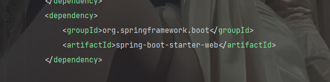
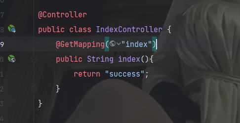
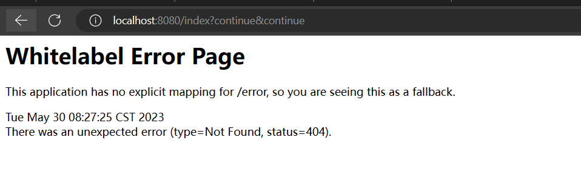

正常情况下，`@RequestBody` 注解用于将请求体中的数据绑定到方法参数上，例如绑定 JSON 请求体到 Java 对象。如果一个控制器方法需要返回字符串或其他类型的响应内容，那么并不需要使用 `@RequestBody` 注解。相反，可以使用 Spring MVC 中的 `@ResponseBody` 注解，告诉 Spring MVC 将方法的返回值作为响应体返回给客户端。

因此，如果您的控制器方法需要返回字符串但是没有使用 `@ResponseBody` 注解，Spring 会默认将它视为视图名称，并尝试从这个名称中解析视图来呈现响应体。如果找不到对应的视图，可能就会出现接口调用无法返回字符串的情况。

**SpringMVC的情况：**

这个是web依赖

接口如果这样写(没有@ResponseBody)：

页面会爆错：

> 原因：因为是SpringMVC，如果没有@ResponseBody，它会把返回字符串当做页面名称进行解析，所以如果你想要返回字符串并在web上显示，必须加上@ResponseBody。