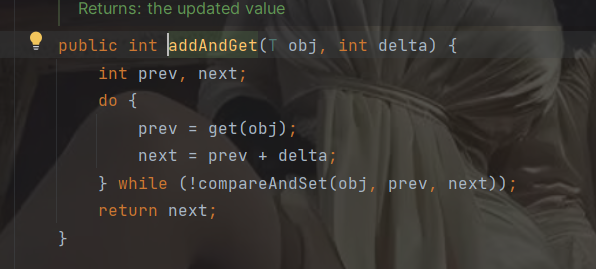

**Atomic开头的类**都是**基于CAS**的，除了**compareAndSet()要用while或者if**，其他的是**不需要自己加while和if就能实现自旋锁和乐观锁**，他内部会自己用现在的值比较原来的值。

> **精隨: ** 除了**compareAndSet()要用while或者if**，**其它的方法内部自带自旋乐观锁**

* 下面的是incrementAndGet的方法和addAndGet的源码，还有其他的就不举例了（自带while的cas方法）：

