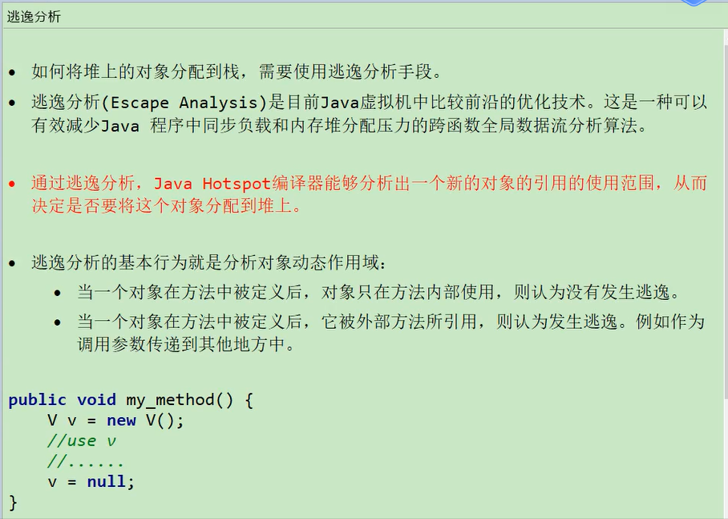
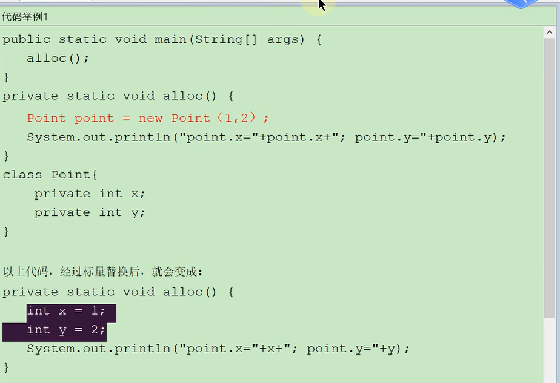
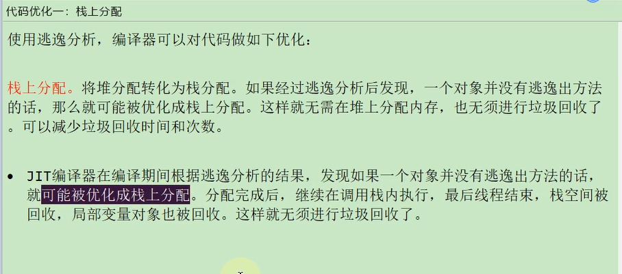
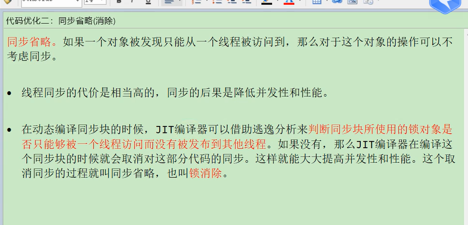

测试：（-XX:+DoEscapeAnalysis:是开启逃逸分析(默认是开启的) -XX:-EliminateAllocations:是关闭标量替换(默认是开启的)）
    

```
-Xmx100m -Xms100m -XX:+DoEscapeAnalysis -XX:+PrintGCDetails -XX:-EliminateAllocations
```

**开启逃逸分析** + **关闭标量替换**  和  **关闭逃逸分析** + **关闭标量替换** 的速度是差不多的

只有两个都开启才能实现**栈上分配**。

> **逃逸分析**（Escape Analysis）是指编译器在分析代码时识别出一个对象的引用是否可能被外部方法所使用，从而确定这个对象是应该存储在栈上还是堆上。
>
> 如果一个对象的引用没有逃逸，则可以将其分配在线程栈上。这样做的好处是，避免了堆内存的分配和垃圾回收开销，提高了程序的运行速度；同时由于对象生命周期与线程相同，也减少了对共享内存的访问，从而加强了程序的可靠性和安全性。

> **标量替换**，则是指通过标签或别名来代替一些较长的名称（如函数名、变量名等），以便于我们快速浏览代码和理解程序结构。例如，在C语言中我们常常使用typedef来定义数据类型别名，或者使用#define来给常量或特定代码块起一个更短的名字。在Java或其他面向对象编程语言中，我们也可以使用继承、接口、注解等方式进行标题替换。


逃逸分析举例:




标量替换举例(助于理解)：因为栈上面都是基本数据类型（如int、float、double等）和一些引用数据类型的变量。**所以得靠标题替换来替换成可以存储到栈上的数据**




栈上分配解释：




 **JIT**除了**栈上分配**和**标题替换**两个优化，**还有一个同步省略**(消除)：

