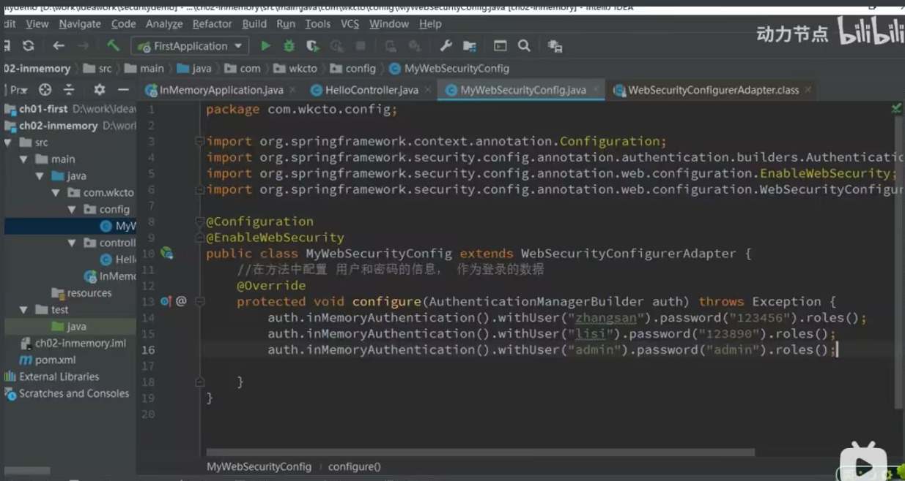

**使用内存中的用户信息**

这里一定要注意！！！

> 在SpringSecurity5.7.0-M2, 我们弃用了 WebSecurityConfigurerAdapter, 因为我们鼓励用户转向使用基于组件 的安全配置

如果是使用了5.7以下的那么就按以下方法来！！！



如果使用了新版Security那么：

```java
@Configuration
public class SecurityConfiguration{
    @Bean
    public InMemoryUserDetailsManager userDetailsService(){
        UserDetails user = User.withDefaultPasswordEncoder()
            .username("user")
            .password("password")
            .roles("USER")
            .build();
        return new InMemoryUserDetailsManager(user);
    }
}
```

