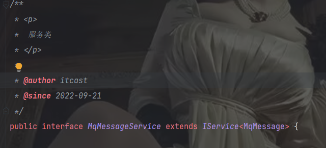
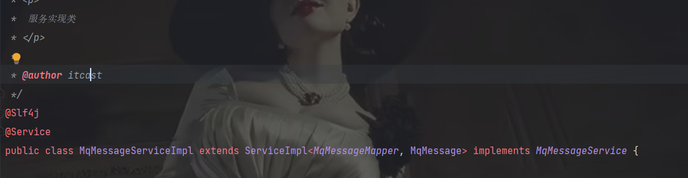
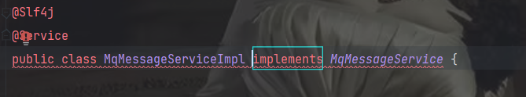
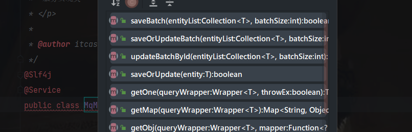

原来是这样的：

​    接口**继承Iservice<>**

上面的接口对应的service**继承ServiceImpl<>**

一开始没搞懂为什么要加这两个继承的原因，后面才知道。

如果你把service继承的**ServiceImpl<>删掉**，他会爆红

然后就会让你 重写 **接口继承的Iservice带来的基本的crud**

**简而言之：**就是service继承serviceimpl你就不用实现接口继承iservice带来的那些简单的crud的方法了(所以这两个继承我认为以后必须每个都写上，很好用)