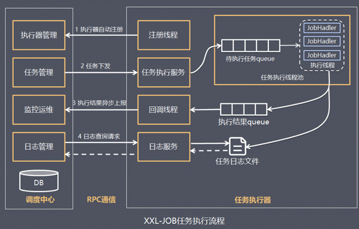

 **什么是分布式任务调度**

**注意：这篇文章中，只有xxl_job是分布式任务调度，其他都不是，只是多线程(也就是普通的任务调度)**

对一个视频的转码可以理解为一个任务的执行，如果视频的数量比较多，如何去高效处理一批任务呢？

1、多线程

多线程是充分利用单机的资源。

2、分布式加多线程

充分利用多台计算机，每台计算机使用多线程处理。

方案2可扩展性更强。

方案2是一种分布式任务调度的处理方案。

什么是分布式任务调度？

我们可以先思考一下下面业务场景的解决方案：

​    每隔24小时执行数据备份任务。

​    12306网站会根据车次不同，设置几个时间点分批次放票。

​    某财务系统需要在每天上午10点前结算前一天的账单数据，统计汇总。

​    商品成功发货后，需要向客户发送短信提醒。

类似的场景还有很多，我们该如何实现？

**多线程方式实现(不是分布式的)：**

学过多线程的同学，可能会想到，我们可以开启一个线程，每sleep一段时间，就去检查是否已到预期执行时间。

以下代码简单实现了任务调度的功能：

```java
public static void main(String[] args) {    
    //任务执行间隔时间
    final long timeInterval = 1000;
    Runnable runnable = new Runnable() {
        public void run() {
            while (true) {
                //TODO：something
                try {
                    Thread.sleep(timeInterval);
                } catch (InterruptedException e) {
                    e.printStackTrace();
                }
            }
        }
    };
    Thread thread = new Thread(runnable);
    thread.start();
}

```

上面的代码实现了按一定的间隔时间执行任务调度的功能。

Jdk也为我们提供了相关支持，如Timer、ScheduledExecutor，下边我们了解下。

**Timer方式实现**(不是分布式)：

  

```java
public static void main(String[]  args){     
    Timer timer = new Timer();     
    timer.schedule(new TimerTask(){       
   @Override       
   public void run() {          
        //TODO：something       
   }      
}, 1000, 2000); //1秒后开始调度，每2秒执行一次   } 
```


​    Timer 的优点在于简单易用，每个Timer对应一个线程，因此可以同时启动多个Timer并行执行多个任务，同一个Timer中的任务是串行执行。

**ScheduledExecutor方式实现**(不是分布式)：

```java
public static void main(String [] agrs){
    ScheduledExecutorService service = Executors.newScheduledThreadPool(10);
    service.scheduleAtFixedRate(
            new Runnable() {
                @Override
                public void run() {
                    //TODO：something
                    System.out.println("todo something");
                }
            }, 1, 2, TimeUnit.SECONDS);
}
```

​    Java 5 推出了基于线程池设计的 ScheduledExecutor，其设计思想是，每一个被调度的任务都会由线程池中一个线程去执行，因此任务是并发执行的，相互之间不会受到干扰。

​    **Timer** 和 **ScheduledExecutor** 都仅能提供基于开始时间与重复间隔的任务调度，不能胜任更加复杂的调度需求。比如，设置每月第一天凌晨1点执行任务、复杂调度任务的管理、任务间传递数据等等。

 

**第三方Quartz**方式实现，项目地址：**https://github.com/quartz-scheduler/quartz**  

​    Quartz 是一个功能强大的任务调度框架，它可以满足更多更复杂的调度需求，Quartz 设计的核心类包括 Scheduler, Job 以及 Trigger。其中，Job 负责定义需要执行的任务，Trigger 负责设置调度策略，Scheduler 将二者组装在一起，并触发任务开始执行。Quartz支持简单的按时间间隔调度、还支持按日历调度方式，通过设置CronTrigger表达式（包括：秒、分、时、日、月、周、年）进行任务调度。

下边是一个例子代码：

  

```java
public static void main(String [] agrs) throws SchedulerException {
    //创建一个Scheduler
    SchedulerFactory schedulerFactory = new StdSchedulerFactory();
    Scheduler scheduler = schedulerFactory.getScheduler();
    //创建JobDetail
    JobBuilder jobDetailBuilder = JobBuilder.newJob(MyJob.class);
    jobDetailBuilder.withIdentity("jobName","jobGroupName");
    JobDetail jobDetail = jobDetailBuilder.build();
    //创建触发的CronTrigger 支持按日历调度
        CronTrigger trigger = TriggerBuilder.newTrigger()
                .withIdentity("triggerName", "triggerGroupName")
                .startNow()
                .withSchedule(CronScheduleBuilder.cronSchedule("0/2 * * * * ?"))
                .build();
    scheduler.scheduleJob(jobDetail,trigger);
    scheduler.start();
}

public class MyJob implements Job {
    @Override
    public void execute(JobExecutionContext jobExecutionContext){
        System.out.println("todo something");
    }
}

```

通过以上内容我们学习了什么是任务调度，任务调度所解决的问题，以及任务调度的多种实现方式。

**任务调度顾名思义，就是对任务的调度，它是指系统为了完成特定业务，基于给定时间点，给定时间间隔或者给定执行次数自动执行任务。**

**什么是分布式任务调度？**

​    通常任务调度的程序是集成在应用中的，比如：优惠卷服务中包括了定时发放优惠卷的的调度程序，结算服务中包括了定期生成报表的任务调度程序，由于采用分布式架构，一个服务往往会部署多个冗余实例来运行我们的业务，在这种分布式系统环境下运行任务调度，我们称之为**分布式任务调度**，如下图：


**分布式调度要实现的目标：**

​    不管是任务调度程序集成在应用程序中，还是单独构建的任务调度系统，如果采用分布式调度任务的方式就相当于将任务调度程序分布式构建，这样就可以具有分布式系统的特点，并且提高任务的调度处理能力：

1、并行任务调度

​    并行任务调度实现靠多线程，如果有大量任务需要调度，此时光靠多线程就会有瓶颈了，因为一台计算机CPU的处理能力是有限的。

​    如果将任务调度程序分布式部署，每个结点还可以部署为集群，这样就可以让多台计算机共同去完成任务调度，我们可以将任务分割为若干个分片，由不同的实例并行执行，来提高任务调度的处理效率。

2、高可用

​    若某一个实例宕机，不影响其他实例来执行任务。

3、弹性扩容

​    当集群中增加实例就可以提高并执行任务的处理效率。

4、任务管理与监测

​    对系统中存在的所有定时任务进行统一的管理及监测。让开发人员及运维人员能够时刻了解任务执行情况，从而做出快速的应急处理响应。

5、避免任务重复执行

​    当任务调度以集群方式部署，同一个任务调度可能会执行多次，比如在上面提到的电商系统中到点发优惠券的例子，就会发放多次优惠券，对公司造成很多损失，所以我们需要控制相同的任务在多个运行实例上只执行一次。

 

**7.2.2 XXL-JOB****介绍**

XXL-JOB是一个轻量级分布式任务调度平台，其核心设计目标是开发迅速、学习简单、轻量级、易扩展。现已开放源代码并接入多家公司线上产品线，开箱即用。

官网：https://www.xuxueli.com/xxl-job/

文档：https://www.xuxueli.com/xxl-job/#%E3%80%8A%E5%88%86%E5%B8%83%E5%BC%8F%E4%BB%BB%E5%8A%A1%E8%B0%83%E5%BA%A6%E5%B9%B3%E5%8F%B0XXL-JOB%E3%80%8B

XXL-JOB主要有调度中心、执行器、任务：


**调度中心：**

​    负责管理调度信息，按照调度配置发出调度请求，自身不承担业务代码；

​    主要职责为执行器管理、任务管理、监控运维、日志管理等

**任务执行器：**

​    负责接收调度请求并执行任务逻辑；

​    只要职责是注册服务、任务执行服务（接收到任务后会放入线程池中的任务队列）、执行结果上报、日志服务等

**任务：**负责执行具体的业务处理。

 

调度中心与执行器之间的工作流程如下：



 

**执行流程：**

​    1.任务执行器根据配置的调度中心的地址，自动注册到调度中心

​    2.达到任务触发条件，调度中心下发任务

​    3.执行器基于线程池执行任务，并把执行结果放入内存队列中、把执行日志写入日志文件中

​    4.执行器消费内存队列中的执行结果，主动上报给调度中心

​    5.当用户在调度中心查看任务日志，调度中心请求任务执行器，任务执行器读取任务日志文件并返回日志详情