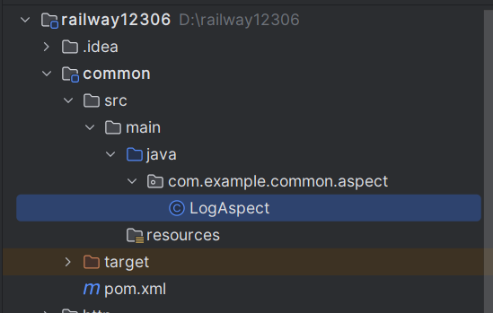
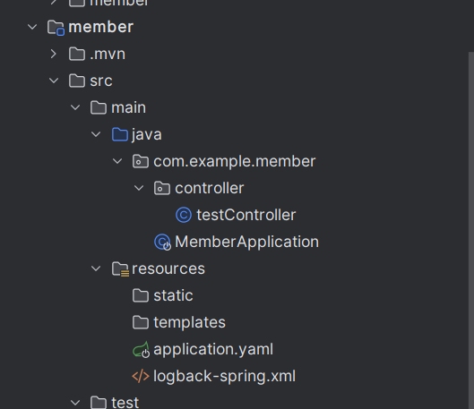

**在公共模块中配置AOP打印log日志。**



**在member模块中想要使用这个组件。**



**添加依赖：**

```pom
      <dependency>
            <groupId>com.example</groupId>
            <artifactId>common</artifactId>
        </dependency>
```

## 重要(误错点)：

**在启动类上添加@CompoentScan("common模块组件的目录"):**

```java
@SpringBootApplication
//扫描公共模块中的AOP的打印log配置(必须的)
@ComponentScan("com.example")
//或者@ComponentScan("com.example.common")只要扫描到组件就可以
public class MemberApplication {
       ...
}
```

或者

```java
@SpringBootApplication(scanBasePackages = "com.example")
public class MemberApplication {
       ...
}
```

**专业化解释：**

> 在Spring框架中，一个模块可以包含多个子模块，每个子模块都可以有自己的配置和组件。如果需要在一个模块中使用另一个模块中的组件，可以使用`@ComponentScan`注解来指定另一个模块中要扫描的包路径，从而自动发现并注册其他模块中的组件。