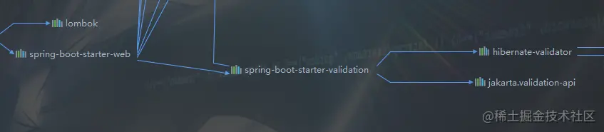

# 一  前言

系统执行业务逻辑之前，会对输入数据进行校验，检测数据是否有效合法的。所以我们可能会写大量的if else等判断逻辑，特别是在不同方法出现相同的数据时，校验的逻辑代码会反复出现，导致代码冗余，阅读性和可维护性极差。

鉴于通用性和普遍性，Spring框架提供了validator组件，通过一些校验器，可以对一些数据进行统一的完整性和有效性等校验，即简单又好用。

JSR-303是Java为Bean数据合法性校验提供的标准框架，它定义了一整套校验注解，可以标注在成员变量，属性方法等之上。

hibernate-validator就提供了这套标准的实现，我们在用Springboot开发web应用时，会引入spring-boot-starter-web依赖，它默认会引入spring-boot-starter-validation依赖，而spring-boot-starter-validation中就引用了hibernate-validator依赖。 

但是，在比较高版本的spring-boot-starter-web中，默认不再引用spring-boot-starter-validation，自然也就不会默认引入到hibernate-validator依赖，需要我们手动添加依赖。

```xml
<dependency>
    <groupId>org.hibernate.validator</groupId>
    <artifactId>hibernate-validator</artifactId>
    <version>6.1.7.Final</version>
</dependency>
```

hibernate-validator中有很多非常简单好用的校验注解，例如NotNull，@NotEmpty，@Min，@Max，@Email，@PositiveOrZero等等。这些注解能解决我们大部分的数据校验问题。如下所示：

```java
java复制代码package com.nobody.dto;

import lombok.Data;

import javax.validation.constraints.*;

@Data
public class UserDTO {

    @NotBlank(message = "姓名不能为空")
    private String name;

    @Min(value = 18, message = "年龄不能小于18")
    private int age;

	@NotEmpty(message = "邮箱不能为空")
    @Email(message = "邮箱格式不正确")
    private String email;
}
```

# 二  自定义参数校验器

但是，hibernate-validator中的这些注解不一定能满足我们全部的需求，我们想校验的逻辑比这复杂。所以，我们可以自定义自己的参数校验器。

首先引入依赖是必不可少的。

```xml
<dependency>
    <groupId>org.hibernate.validator</groupId>
    <artifactId>hibernate-validator</artifactId>
    <version>6.1.7.Final</version>
</dependency>
```

最近不是基金很火吗，一大批的韭菜疯狂地涌入买基金的浪潮中。我就以用户开户为例，首先要校验此用户是不是成年人（即不能小于18岁），以及名字是不是以"新韭菜"开头的，符合条件的才允许开户。

定义一个注解，用于校验用户的姓名是不是以“新韭菜”开头的。

```java
java复制代码package com.nobody.annotation;

import com.nobody.validator.IsLeekValidator;

import javax.validation.Constraint;
import javax.validation.Payload;
import java.lang.annotation.*;

/**
 * @Description 校验是否韭菜的注解
 * @Author Mr.nobody
 * @Date 2021/3/11
 * @Version 1.0
 */
@Retention(RetentionPolicy.RUNTIME)
@Target(ElementType.FIELD)
@Documented
@Constraint(validatedBy = IsLeekValidator.class) // 指定我们自定义的校验类
public @interface IsLeek {

    /**
     * 是否强制校验
     * 
     * @return 是否强制校验的boolean值
     */
    boolean required() default true;

    /**
     * 校验不通过时的报错信息
     * 
     * @return 校验不通过时的报错信息
     */
    String message() default "此用户不是韭零后，无法开户！";

    /**
     * 将validator进行分类，不同的类group中会执行不同的validator操作
     * 
     * @return validator的分类类型
     */
    Class<?>[] groups() default {};

    /**
     * 主要是针对bean，很少使用
     * 
     * @return 负载
     */
    Class<? extends Payload>[] payload() default {};

}
```

定义校验类，实现ConstraintValidator接口，接口使用了泛型，需要指定两个参数，第一个是自定义注解，第二个是需要校验的数据类型。重写2个方法，initialize方法主要做一些初始化操作，它的参数是我们使用到的注解，可以获取到运行时的注解信息。isValid方法就是要实现的校验逻辑，被注解的对象会传入此方法中。

```java
java复制代码package com.nobody.validator;

import com.nobody.annotation.IsLeek;
import org.springframework.util.StringUtils;

import javax.validation.ConstraintValidator;
import javax.validation.ConstraintValidatorContext;

/**
 * @Description 自定义校验器
 * @Author Mr.nobody
 * @Date 2021/3/11
 * @Version 1.0
 */
public class IsLeekValidator implements ConstraintValidator<IsLeek, String> {

    // 是否强制校验
    private boolean required;

    @Override
    public void initialize(IsLeek constraintAnnotation) {
        this.required = constraintAnnotation.required();
    }

    @Override
    public boolean isValid(String name, ConstraintValidatorContext constraintValidatorContext) {
        if (required) {
            // 名字以"新韭菜"开头的则校验通过
            return !StringUtils.isEmpty(name) && name.startsWith("新韭菜");
        }
        return false;
    }
}
```

# 三  使用自定义注解

通过以上几个步骤，我们自定义的校验注解就完成了，我们使用测试下效果。

```java
java复制代码package com.nobody.dto;

import com.nobody.annotation.IsLeek;
import lombok.Data;

import javax.validation.constraints.*;

/**
 * @Description
 * @Author Mr.nobody
 * @Date 2021/3/11
 * @Version 1.0
 */
@Data
public class UserDTO {

    @NotBlank(message = "姓名不能为空")
    @IsLeek // 我们自定义的注解
    private String name;

    @Min(value = 18, message = "年龄不能小于18")
    private int age;

    @NotEmpty(message = "邮箱不能为空")
    @Email(message = "邮箱格式不正确")
    private String email;
}
```

写个接口，模拟用户开户业务，调用测试。注意，记得加上@Valid注解开启校验，不然不生效。

```java
java复制代码package com.nobody.controller;

import com.nobody.dto.UserDTO;
import org.springframework.web.bind.annotation.PostMapping;
import org.springframework.web.bind.annotation.RequestBody;
import org.springframework.web.bind.annotation.RequestMapping;
import org.springframework.web.bind.annotation.RestController;

import javax.validation.Valid;

/**
 * @Description
 * @Author Mr.nobody
 * @Date 2021/3/11
 * @Version 1.0
 */
@RestController
@RequestMapping("user")
public class UserController {

    @PostMapping("add")
    public UserDTO add(@RequestBody @Valid UserDTO userDTO) {
        System.out.println(">>> 用户开户成功...");
        return userDTO;
    }

}
```

如果参数校验不通过，会抛出MethodArgumentNotValidException异常，我们全局处理下然后返回给接口。

```java
java复制代码package com.nobody.exception;

import javax.servlet.http.HttpServletRequest;

import org.springframework.web.bind.MethodArgumentNotValidException;
import org.springframework.web.bind.annotation.ControllerAdvice;
import org.springframework.web.bind.annotation.ExceptionHandler;
import org.springframework.web.bind.annotation.ResponseBody;

import lombok.extern.slf4j.Slf4j;

/**
 * @Description 统一异常处理
 * @Author Mr.nobody
 * @Date 2020/10/23
 * @Version 1.0
 */
@ControllerAdvice
@Slf4j
public class GlobalExceptionHandler {

    // 处理接口参数数据格式错误异常
    @ExceptionHandler(value = MethodArgumentNotValidException.class)
    @ResponseBody
    public Object errorHandler(HttpServletRequest request, MethodArgumentNotValidException e) {
        return e.getBindingResult().getAllErrors();
    }
}
```

我们先测试用户姓名不带"新韭菜"前缀的进行测试，发现校验不通过，证明注解生效了。

```bash
POST http://localhost:8080/user/add
Content-Type: application/json

{"name": "小绿", "age": 19, "email": "845136542@qq.com"}
[
  {
    "codes": [
      "IsLeek.userDTO.name",
      "IsLeek.name",
      "IsLeek.java.lang.String",
      "IsLeek"
    ],
    "arguments": [
      {
        "codes": [
          "userDTO.name",
          "name"
        ],
        "arguments": null,
        "defaultMessage": "name",
        "code": "name"
      },
      true
    ],
    "defaultMessage": "此用户不是韭零后，无法开户！",
    "objectName": "userDTO",
    "field": "name",
    "rejectedValue": "小绿",
    "bindingFailure": false,
    "code": "IsLeek"
  }
```

如果多个参数校验失败，报错信息也都能获得。如下所示，姓名和邮箱都校验失败。

```bash
POST http://localhost:8080/user/add
Content-Type: application/json

{"name": "小绿", "age": 19, "email": "84513654"}
bash复制代码[
  {
    "codes": [
      "Email.userDTO.email",
      "Email.email",
      "Email.java.lang.String",
      "Email"
    ],
    "arguments": [
      {
        "codes": [
          "userDTO.email",
          "email"
        ],
        "arguments": null,
        "defaultMessage": "email",
        "code": "email"
      },
      [],
      {
        "defaultMessage": ".*",
        "codes": [
          ".*"
        ],
        "arguments": null
      }
    ],
    "defaultMessage": "邮箱格式不正确",
    "objectName": "userDTO",
    "field": "email",
    "rejectedValue": "84513654",
    "bindingFailure": false,
    "code": "Email"
  },
  {
    "codes": [
      "IsLeek.userDTO.name",
      "IsLeek.name",
      "IsLeek.java.lang.String",
      "IsLeek"
    ],
    "arguments": [
      {
        "codes": [
          "userDTO.name",
          "name"
        ],
        "arguments": null,
        "defaultMessage": "name",
        "code": "name"
      },
      true
    ],
    "defaultMessage": "此用户不是韭零后，无法开户！",
    "objectName": "userDTO",
    "field": "name",
    "rejectedValue": "小绿",
    "bindingFailure": false,
    "code": "IsLeek"
  }
]
```

以下是所有参数校验通过的情况：

```bash
POST http://localhost:8080/user/add
Content-Type: application/json

{"name": "新韭菜小绿", "age": 19, "email": "84513654@qq.com"}
bash复制代码{
  "name": "新韭菜小绿",
  "age": 19,
  "email": "84513654@qq.com"
}
```

我们可能会将UserDTO对象用在不同的接口中接收参数，比如在新增和修改接口中。在新增接口中，不需要校验userId；在修改接口中需要校验userId。那注解中的groups字段就派上用场了。groups和@Validated配合能控制哪些注解需不需要开启校验。

我们首先定义2个groups分组接口Update和Create，并且继承Default接口。当然也可以不继承Default接口，因为使用注解时不显示指定groups的值，则默认为groups = {Default.class}。所以继承了Default接口，在用@Validated(Create.class)时，也会校验groups = {Default.class}的注解。

```java
package com.nobody.annotation;

import javax.validation.groups.Default;

/**
 * @Description
 * @Author Mr.nobody
 * @Date 2021/3/13
 * @Version 1.0
 */
public interface Create extends Default {
}
java复制代码package com.nobody.annotation;

import javax.validation.groups.Default;

/**
 * @Description
 * @Author Mr.nobody
 * @Date 2021/3/13
 * @Version 1.0
 */
public interface Update extends Default {
}
```

在用到注解的地方，填写groups的值。

```java
package com.nobody.dto;

import com.nobody.annotation.Create;
import com.nobody.annotation.IsLeek;
import com.nobody.annotation.Update;
import lombok.Data;

import javax.validation.constraints.*;

/**
 * @Description
 * @Author Mr.nobody
 * @Date 2021/3/11
 * @Version 1.0
 */
@Data
public class UserDTO {

    @NotBlank(message = "用户ID不能为空", groups = Update.class)
    private String userId;

    @NotBlank(message = "姓名不能为空", groups = {Update.class, Create.class})
    @IsLeek
    private String name;

    @Min(value = 18, message = "年龄不能小于18")
    private int age;

    @NotEmpty(message = "邮箱不能为空")
    @Email(message = "邮箱格式不正确")
    private String email;
}
```

最后，在需要声明校验的地方，通过@Validated的指定即可。

```java
package com.nobody.controller;

import com.nobody.annotation.Create;
import com.nobody.annotation.Update;
import com.nobody.dto.UserDTO;
import org.springframework.validation.annotation.Validated;
import org.springframework.web.bind.annotation.PostMapping;
import org.springframework.web.bind.annotation.RequestBody;
import org.springframework.web.bind.annotation.RequestMapping;
import org.springframework.web.bind.annotation.RestController;

/**
 * @Description
 * @Author Mr.nobody
 * @Date 2021/3/11
 * @Version 1.0
 */
@RestController
@RequestMapping("user")
public class UserController {

    @PostMapping("add")
    public Object add(@RequestBody @Validated(Create.class) UserDTO userDTO) {
        System.out.println(">>> 用户开户成功...");
        return userDTO;
    }

    @PostMapping("update")
    public Object update(@RequestBody @Validated(Update.class) UserDTO userDTO) {
        System.out.println(">>> 用户信息修改成功...");
        return userDTO;
    }

}
```

调用add接口时，即使不传userId也能通过，即不对userId进行校验。

```java
POST http://localhost:8080/user/add
Content-Type: application/json

{"name": "新韭菜小绿", "age": 18, "email": "84513654@qq.com"}
java复制代码{
  "userId": null,
  "name": "新韭菜小绿",
  "age": 18,
  "email": "84513654@qq.com"
}
```

调用update接口时，不传userId，会校验不通过。

```java
POST http://localhost:8080/user/update
Content-Type: application/json

{"name": "新韭菜小绿", "age": 18, "email": "84513654@qq.com"}
java复制代码[
  {
    "codes": [
      "NotBlank.userDTO.userId",
      "NotBlank.userId",
      "NotBlank.java.lang.String",
      "NotBlank"
    ],
    "arguments": [
      {
        "codes": [
          "userDTO.userId",
          "userId"
        ],
        "arguments": null,
        "defaultMessage": "userId",
        "code": "userId"
      }
    ],
    "defaultMessage": "用户ID不能为空",
    "objectName": "userDTO",
    "field": "userId",
    "rejectedValue": null,
    "bindingFailure": false,
    "code": "NotBlank"
  }
]
```

> 此演示项目已上传到Github，如有需要可自行下载，欢迎 Star 。 [github.com/LucioChn/sp…](https://link.juejin.cn?target=https%3A%2F%2Fgithub.com%2FLucioChn%2Fspring)